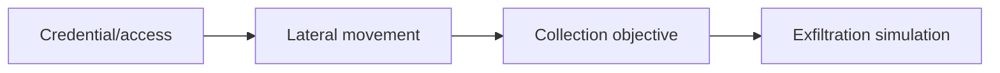

# Lateral Operations & Objectives

## 🗺️ Zero-to-Mastery Learning Path

1. [[Red Team Credential Access]]
2. [[Red Team Lateral Movement]]
3. [[Data Collection Simulation]]
4. [[Data Exfiltration Simulation]]

---
> 🔼 Up: [[Red Team Operations]]
