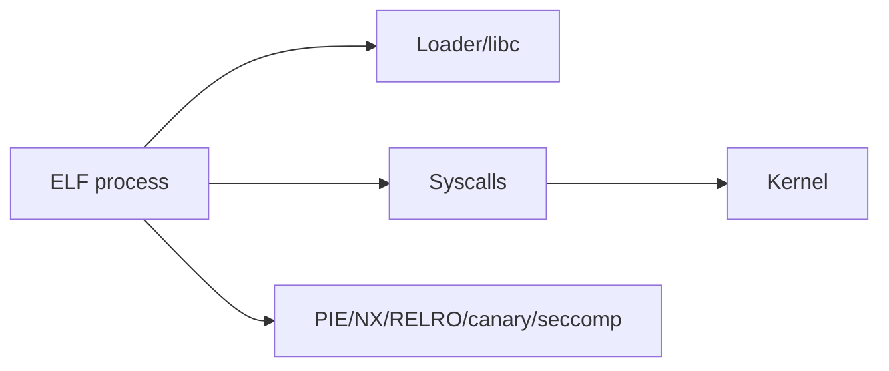
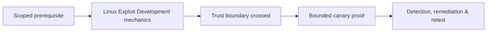

# Linux Exploit Development

Linux exploitation combines ELF/dynamic linking, System V ABI, glibc/allocators, syscalls, signals, namespaces, capabilities, seccomp, and kernel interfaces.



Study GOT/PLT and relocations, core dumps, symbol/version differences, allocator behavior, `/proc`, ASLR, privilege transitions, and sandbox constraints. Use GDB/sanitizers on owned binaries.

Mastery lab: triage an ELF crash, inspect mappings and hardening, build a benign proof, then enable full RELRO/PIE/canary and fix the memory bug.

## Platform workflow

Record architecture, kernel, libc and loader versions, container or namespace context, seccomp profile, capabilities, environment, resource limits, and the exact ELF build. Inspect program headers, dynamic dependencies, relocations, symbols, and process mappings before reasoning about addresses.

```shell-session
$ file ./fixture
ELF 64-bit LSB pie executable, x86-64, dynamically linked
$ readelf -W -l ./fixture | grep GNU
  GNU_STACK      ... RW
  GNU_RELRO      ... R
```

Trace privilege transitions across real/effective/saved IDs, file capabilities, namespaces, and set-ID execution. Core-dump behavior, ASLR, loader environment filtering, and sandbox policy can change observability. Validate the bug under sanitizers, derive only the minimum safe primitive, and compare hardened builds. Defenders should retain crash telemetry, core handling, audit events, executable-memory transitions, and anomalous privilege changes while engineering removes the root defect.

---
> 🔼 Up: [[Platform Exploitation]]

## Core Concept

**Linux Exploit Development** is the atomic learning objective of this note. Identify its trust boundary, prerequisites, attacker-controlled input or state, vulnerable transformation, violated security invariant, minimum evidence, business consequence, and safe stopping point. The mechanism must remain explainable without depending on a specific product.

## Visual Attack Flow



## Practical Payloads & Execution

```text
fixture=Linux Exploit Development
build=instrumented-debug
action=trigger minimized canary input
impact_ceiling=fixed marker or deterministic crash
```

### Expected output

```text
result=C2R_CANARY_PROOF
mitigation_state=recorded
production_boundary_crossed=false
```

Treat the output as proof of only the stated condition. Repeat with a negative control, preserve timestamps and the affected build, and never expand impact merely because another path appears reachable.

## Real-World Scenario

A vendor-owned instrumented build reproduces **Linux Exploit Development**. The researcher demonstrates only a fixed marker or deterministic crash, records architecture and mitigation assumptions, patches the root defect, and retains the minimized input as a regression test.

The durable remediation belongs at the authoritative enforcement layer. Retest the original condition and meaningful variants while verifying legitimate workflows still function.
