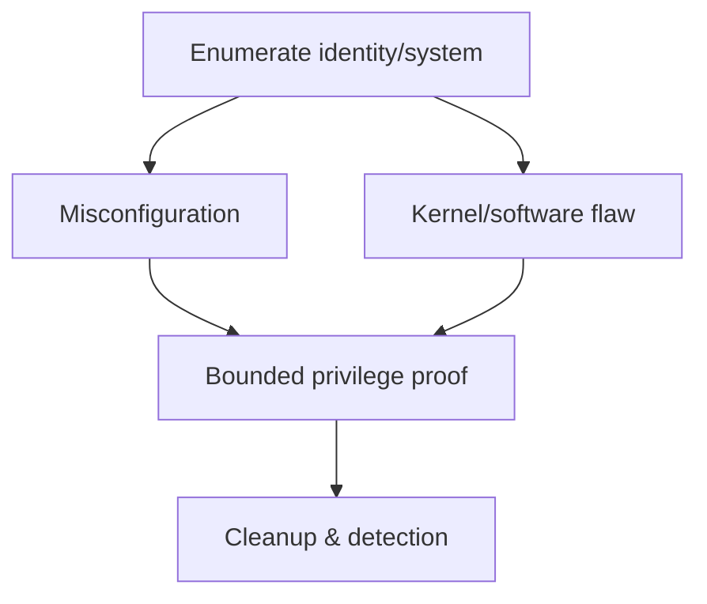

# Linux Privilege Escalation Testing

Linux escalation converts local identity and system configuration into higher effective authority.



Cover sudoers, SUID/SGID, capabilities, writable services/scripts, PATH/environment, cron/systemd timers, credentials, groups, sockets, NFS, containers, namespaces/cgroups, libraries, kernel exposure, and application secrets. Verify ownership, effective IDs, mount options, and execution context.

```shell-session
analyst@range:~$ id
uid=1001(canary) gid=1001(canary) groups=1001(canary),998(docker)
analyst@range:~$ getcap -r / 2>/dev/null | head
/usr/bin/ping cap_net_raw=ep
```

Do not run public kernel exploits on production without explicit approval. Prefer proving writable privileged execution with a canary marker and immediate rollback. Mastery lab: build one fixture per category and map each to least-privilege remediation and telemetry.

---
> 🔼 Up: [[Post-Exploitation & Persistence]]

## Core Concept

**Linux Privilege Escalation Testing** is the atomic learning objective of this note. Identify its trust boundary, prerequisites, attacker-controlled input or state, vulnerable transformation, violated security invariant, minimum evidence, business consequence, and safe stopping point. The mechanism must remain explainable without depending on a specific product.

## Visual Attack Flow


## Practical Payloads & Execution

```text
fixture=Linux Privilege Escalation Testing
build=instrumented-debug
action=trigger minimized canary input
impact_ceiling=fixed marker or deterministic crash
```

### Expected output

```text
result=C2R_CANARY_PROOF
mitigation_state=recorded
production_boundary_crossed=false
```

Treat the output as proof of only the stated condition. Repeat with a negative control, preserve timestamps and the affected build, and never expand impact merely because another path appears reachable.

## Real-World Scenario

A vendor-owned instrumented build reproduces **Linux Privilege Escalation Testing**. The researcher demonstrates only a fixed marker or deterministic crash, records architecture and mitigation assumptions, patches the root defect, and retains the minimized input as a regression test.

The durable remediation belongs at the authoritative enforcement layer. Retest the original condition and meaningful variants while verifying legitimate workflows still function.
