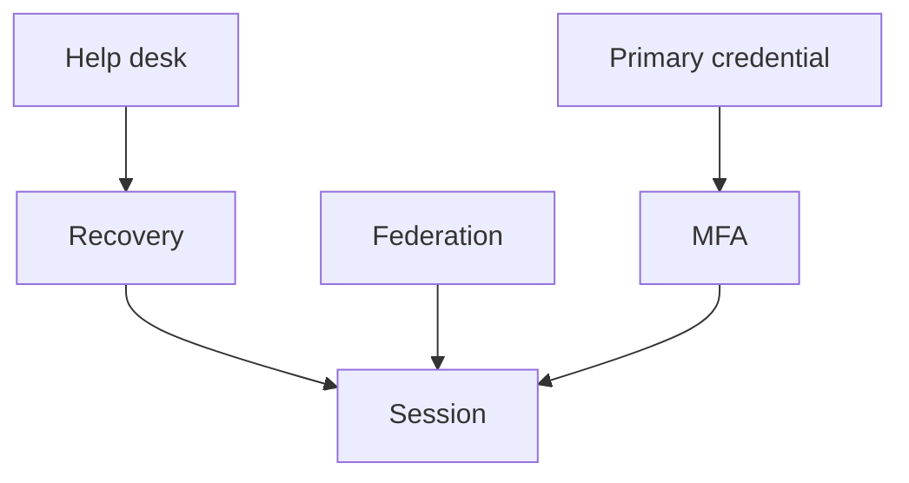
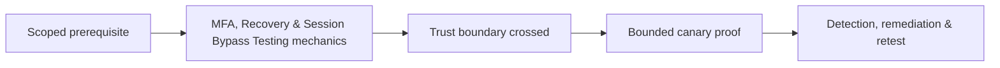

# MFA, Recovery & Session Bypass Testing

Account security equals the weakest route through login, MFA enrollment/reset, recovery, trusted devices, federation, help desk, session refresh, and sensitive-action reauthentication.



Test response manipulation, direct endpoint access, challenge binding, OTP reuse/expiry, rate controls, backup codes, device trust, factor replacement, recovery tokens, notification, session rotation, and invalidation after password/MFA change. Race testing uses canary accounts and tiny bounded concurrency.

```text
Action: remove factor from canary account
Expected: recent password + existing factor
Observed: recovery session alone accepted
Impact: compromised mailbox can remove MFA
```

Never trigger fatigue against real users. Remediate with phishing-resistant factors, transaction-bound challenges, strong recovery, rate limits, alerts, recent-auth requirements, and global session revocation. Mastery lab: map all account-control paths and prove each reaches the same assurance level.

---
> 🔼 Up: [[Web Identity & Access Control]]

## Core Concept

**MFA, Recovery & Session Bypass Testing** is the atomic learning objective of this note. Identify its trust boundary, prerequisites, attacker-controlled input or state, vulnerable transformation, violated security invariant, minimum evidence, business consequence, and safe stopping point. The mechanism must remain explainable without depending on a specific product.

## Visual Attack Flow



## Practical Payloads & Execution

```http
POST /c2r-lab/mfa-recovery-session-bypass-testing HTTP/1.1
Host: app.example.test
Authorization: Bearer <CANARY_IDENTITY>
Content-Type: application/json

{"object":"C2R-CANARY","test":true}
```

### Expected output

```text
HTTP/1.1 200 OK
X-C2R-Result: vulnerable-condition-observed
{"marker":"C2R-CANARY-PROOF"}
```

Treat the output as proof of only the stated condition. Repeat with a negative control, preserve timestamps and the affected build, and never expand impact merely because another path appears reachable.

## Real-World Scenario

A multi-tenant enterprise service exposes a scoped **MFA, Recovery & Session Bypass Testing** condition to a synthetic customer account. The assessor proves one trust-boundary failure with a canary object, correlates application and identity telemetry, removes test state, and assigns the authoritative server-side control.

The durable remediation belongs at the authoritative enforcement layer. Retest the original condition and meaningful variants while verifying legitimate workflows still function.
