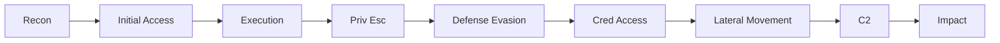

# ⚔️ MITRE ATT&CK & Threat Models

> [!abstract] Note of [[Methodologies & Frameworks]]
> Frameworks give the chaos of "hacking" a shared vocabulary. **MITRE ATT&CK** catalogues *how* adversaries behave; the **Diamond Model** structures *who* did *what* to *whom*. Together they turn a scattered engagement into a mappable, communicable campaign — the language both red and blue teams speak.

## MITRE ATT&CK — the behaviour catalogue
ATT&CK (**Adversarial Tactics, Techniques & Common Knowledge**) is a living matrix of real-world adversary behaviour, organised as:
- **Tactics** — the *why*, the adversary's goal for a step (the column headers): Reconnaissance, Resource Development, Initial Access, Execution, Persistence, Privilege Escalation, Defense Evasion, Credential Access, Discovery, Lateral Movement, Collection, Command & Control, Exfiltration, Impact.
- **Techniques / Sub-techniques** — the *how* (e.g. **T1055** Process Injection, **T1003** OS Credential Dumping, **T1550** Use Alternate Authentication Material). Every technique is what it's called throughout this vault.
- **Procedures** — the specific implementation a given group/tool uses.

Together these are **TTPs** (Tactics, Techniques, Procedures). Matrices exist for **Enterprise** (Win/Linux/macOS/Cloud), **Mobile**, and **ICS**.



**Why it matters:** a red team maps its actions to ATT&CK IDs so the report says exactly what was tested; a blue team maps its **detections** to the same IDs to measure coverage. The framework is the bridge between offense and defense.

## The Pyramid of Pain
David Bianco's **Pyramid of Pain** ranks indicators by how much it *hurts the attacker* when you detect them:
```
        TTPs            ← hardest to change  (🔥 tough)
     Tools
  Network/Host Artifacts
    Domain Names
      IP Addresses
   Hash Values         ← trivial to change  (easy)
```
Blocking a hash or IP costs the adversary nothing (they rotate it). Detecting a **TTP** (e.g. "LSASS accessed by a non-system process") forces them to change *how they operate* — which is expensive. Mature detection engineering aims at the top of the pyramid.

## The Diamond Model of Intrusion Analysis
Where ATT&CK describes behaviour, the **Diamond Model** structures a single intrusion event around four linked vertices:
```
            Adversary
               /\
              /  \
   Infrastructure  Capability
              \  /
               \/
             Victim
```
- **Adversary** — who is behind it. **Capability** — the tools/techniques (their ATT&CK TTPs). **Infrastructure** — the C2, domains, and redirectors used. **Victim** — the target.
- **The power move:** pivoting along an edge. Discover one piece of **infrastructure** and you can find other **victims** it targeted; identify a **capability** and you can attribute it to an **adversary**. It's the analyst's tool for turning one alert into a full picture.

## Other models worth naming
- **Cyber Kill Chain** — Lockheed Martin's linear 7-stage view of an intrusion (its own note in this branch).
- **Unified Kill Chain** — merges ATT&CK + Kill Chain into 18 phases.
- **STRIDE / DREAD / PASTA** — *design-time* threat-modelling frameworks (STRIDE: Spoofing, Tampering, Repudiation, Info disclosure, DoS, Elevation) used to reason about a system before it ships.

> [!tip] Crook → Root
> **Crook** says "I got a shell." **Root** says "I achieved **Execution (T1059)** via a phishing macro (**Initial Access, T1566.001**), escalated with an **unquoted service path (T1574.009)**, and the whole capability maps to this adversary's known infrastructure." Same actions — but now they're measurable, reportable, and detectable.

---
> 🔼 Up: [[Methodologies & Frameworks]]
