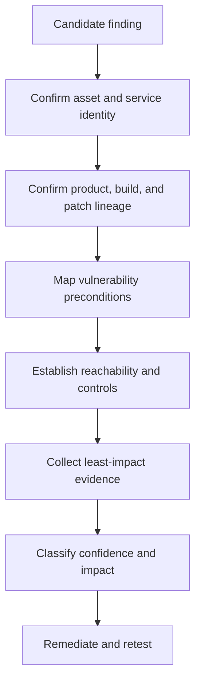
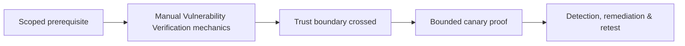

# Manual Vulnerability Verification

> [!abstract] Methodology
> Verification transforms an automated claim into a defensible technical conclusion. It confirms asset identity, exact build and patch lineage, vulnerability preconditions, reachable attack path, least-impact proof, business consequences, severity, and remediation. Tool syntax belongs in the Armory; judgment belongs here.

> [!danger] Controlled proof only
> Prefer non-destructive evidence and representative labs. Obtain separate approval before any action that could execute code, alter data, crash a service, access another user's information, bypass authentication, or cross a trust boundary.

## Verification chain



Skipping any link weakens the conclusion. A banner does not prove a build; an affected build does not prove the feature is enabled; an enabled feature does not prove the attacker can reach it.

## Confirm asset identity

Validate hostname, address, virtual host, certificate identity, cloud account, tenant, service instance, and ownership. CDNs, reverse proxies, shared hosting, stale DNS, and load balancers can make a technically correct probe refer to the wrong organization or backend.

Record the observation time and network vantage point. Dynamic environments may change during verification.

## Confirm product and patch lineage

Use independent evidence:

- Authenticated package or build inventory.
- Vendor-specific build number.
- Binary/file version.
- Protocol behavior unique to a release family.
- Configuration or module state.
- Vendor advisory and fixed-package statement.

Backporting is critical: a distribution may retain an older upstream version string while applying the security patch in its package revision. Compare the full vendor build, not only the upstream semantic version.

## Build the advisory chain

Prioritize sources:

1. Vendor advisory and fixed-version statement.
2. Upstream project advisory, patch, or commit.
3. CVE record and standardized metadata.
4. Known-exploitation catalogs and exploitation-probability data.
5. Reputable technical analysis and public proof-of-concept research.

Extract the actual preconditions:

```text
Affected component and version range
Required feature or configuration
Attacker network position
Authentication and privileges
Required user interaction
Architecture or operating-system dependency
Impact on confidentiality, integrity, availability
Vendor-fixed build and available mitigations
```

## Public exploit intelligence

Public exploit repositories and research can clarify reachability, vulnerable code paths, and proof conditions. Treat every PoC as untrusted software. Before any lab execution, review:

- Hard-coded targets, callbacks, credentials, and destructive actions.
- File writes, service restarts, persistence, cleanup, and crash behavior.
- Claimed CVE and version accuracy.
- Dependencies, privileges, and network assumptions.
- Repository provenance and commit history.
- Whether the proof can be reduced to a harmless condition check.

Never run an unknown PoC directly against production.

## Representative lab design

Reproduce the variables that control vulnerability:

- Exact vendor build, architecture, and operating system.
- Feature flags, modules, authentication, and data shape.
- Reverse proxy, middleware, sandbox, and mitigations.
- Network position and trust boundary.
- Relevant filesystem, kernel, or service-manager behavior.

Snapshot before testing, hash the PoC and dependencies, restrict egress, and define expected proof and cleanup. A generic container may not represent an appliance, kernel interaction, or proxy chain accurately.

## Least-impact proof hierarchy

Prefer the first level that proves the condition:

1. Authenticated build/configuration evidence.
2. Benign response difference.
3. Synthetic test-account authorization bypass.
4. Read of a tester-created canary object.
5. Harmless callback to engagement-controlled infrastructure.
6. Controlled code execution in a representative lab.
7. Production impact proof only with explicit additional approval.

Do not retrieve real secrets when a canary proves file read. Do not crash production when vendor build and lab reproduction prove a denial-of-service condition.

## Classification

| Result | Meaning |
|---|---|
| True positive | Vulnerable condition and relevant preconditions verified |
| False positive | Detection premise is wrong |
| Mitigated | Vulnerable component exists but a control blocks the tested path |
| Not exploitable in context | Required precondition is absent from the agreed threat model |
| Inconclusive | Evidence is insufficient or contradictory |
| Accepted risk | Valid condition retained through an authorized decision |

Failure to exploit is not automatically a false positive. A protective control blocking one payload does not automatically mean the root cause is fixed.

## CVSS and technical severity

CVSS describes the intrinsic technical severity of a defined vulnerable condition. Score from verified facts:

- Attack vector and attack complexity.
- Privileges required and user interaction.
- Impact to confidentiality, integrity, and availability.
- Impact to the vulnerable system and, in modern scoring, subsequent systems.

Record the full vector and assumptions. A number without its vector is not reproducible.

## Exploitation likelihood and business priority

Technical severity is not the same as remediation priority. Add:

- Evidence of exploitation in the wild.
- Exploitation probability and maturity.
- External exposure and reachability.
- Asset criticality, regulated data, and safety impact.
- Ability to pivot to identity or management planes.
- Detection, segmentation, and compensating controls.
- Remediation complexity and recovery readiness.

The correct priority is a transparent decision based on verified technical and business context.

## Evidence-quality ladder

From weakest to strongest:

1. Generic banner or technology guess.
2. Automated version/signature match.
3. Authenticated build evidence.
4. Vulnerable feature and reachable path confirmed.
5. Harmless manual proof reproduces the condition.
6. Fixed-build retest proves remediation.

State the evidence level explicitly so readers understand uncertainty.

## Finding structure

Every verified finding should contain:

```text
Affected asset and observation time
Verified product/build/configuration
Root cause and required preconditions
Minimal reproducible evidence
Threat path and business impact
Technical severity vector and assumptions
Remediation and temporary mitigation
Detection opportunities
Retest procedure and final status
```

Screenshots alone are weak evidence. Preserve request/response data, local build evidence, timestamps, tester source, and cleanup while redacting secrets.

## Retesting

Retest the root cause, not merely the original payload. Confirm the fixed build/configuration, repeat the minimal proof, check equivalent paths, validate compensating controls, and retain before/after evidence. Close only when the condition is removed or an authorized risk decision is documented.

At root level, verification is epistemic discipline: every sentence distinguishes observation, inference, uncertainty, and conclusion. A reviewer should be able to reproduce the logic without trusting the scanner or the tester's reputation.

---
> 🔼 Up: [[Vulnerability Assessment]]

## Core Concept

**Manual Vulnerability Verification** is the atomic learning objective of this note. Identify its trust boundary, prerequisites, attacker-controlled input or state, vulnerable transformation, violated security invariant, minimum evidence, business consequence, and safe stopping point. The mechanism must remain explainable without depending on a specific product.

## Visual Attack Flow



## Practical Payloads & Execution

```text
target=198.51.100.20 or designated enterprise canary
identity=assessment-user
action=Manual Vulnerability Verification
rate_and_scope=approved
```

### Expected output

```text
observable_result=C2R_CANARY_PROOF
unauthorized_targets=0
evidence_timestamp=recorded
```

Treat the output as proof of only the stated condition. Repeat with a negative control, preserve timestamps and the affected build, and never expand impact merely because another path appears reachable.

## Real-World Scenario

A scoped enterprise infrastructure assessment applies **Manual Vulnerability Verification** only to documentation-range addresses and designated canary services. Activity is rate-limited, ownership is verified, protocol evidence is captured, and broad exploitation is explicitly avoided.

The durable remediation belongs at the authoritative enforcement layer. Retest the original condition and meaningful variants while verifying legitimate workflows still function.
