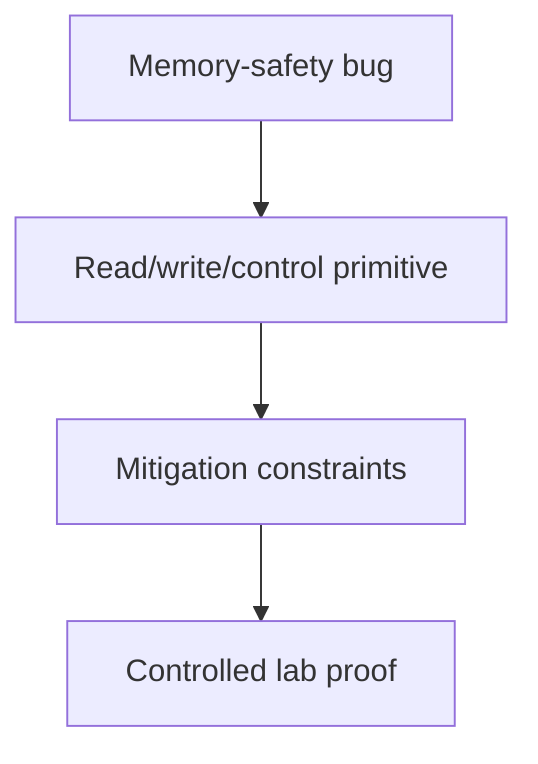

# Memory Corruption Exploitation

## 🗺️ Zero-to-Mastery Learning Path

1. [[Integer, Type Confusion & Logic-to-Memory Bugs]]
2. [[Stack Corruption]]
3. [[Format String Vulnerabilities]]
4. [[Heap Exploitation Fundamentals]]
5. [[Use-After-Free & Object Lifetime Bugs]]

---
> 🔼 Up: [[Exploit Development]]
