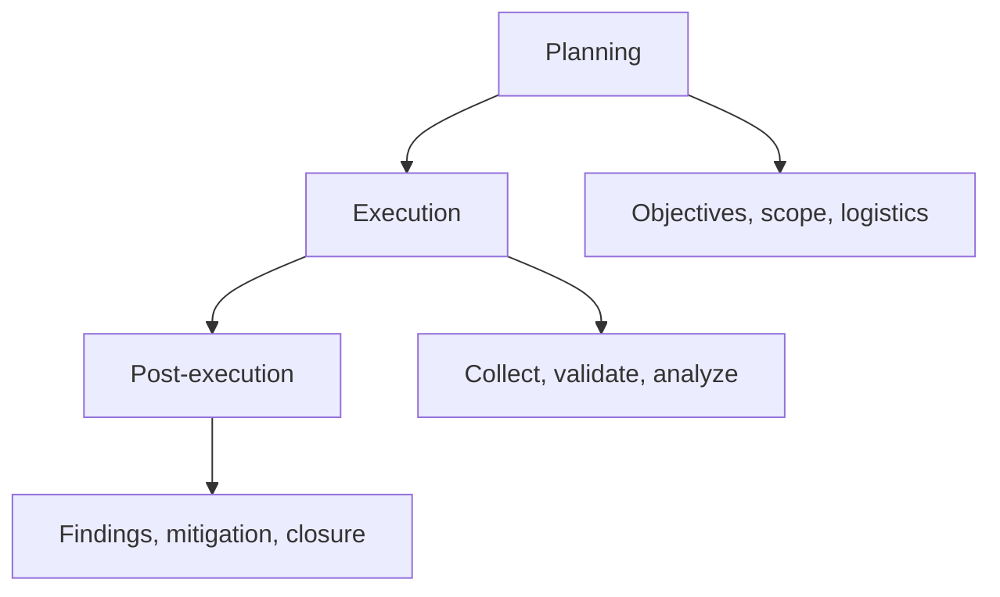

# NIST SP 800-115

NIST SP 800-115 frames security testing as planning, execution, and post-execution activities supported by examination, interviewing, and technical testing. It helps enterprise teams choose techniques based on assurance needs and operational risk.



## Technique selection

Review, network discovery, vulnerability scanning, password auditing, log review, integrity checking, penetration testing, and social engineering provide different evidence and risk. Select the least invasive technique capable of answering the assurance question.

| Question | Appropriate evidence |
|---|---|
| Are patches missing? | Authenticated configuration/package assessment |
| Is segmentation effective? | Controlled traffic from defined zones plus firewall telemetry |
| Can one tenant access another? | Two test identities and bounded object-level proof |
| Can defenders observe behavior? | Purple-team canary with expected telemetry |

## Assessment plan

```text
Objective: Validate management-plane isolation
Sources: Corp workstation, guest VLAN
Targets: Three canary management endpoints
Methods: Route observation, bounded TCP tests, authenticated application check
Abort: unexpected production impact or SOC escalation
Success: guest denied; corp restricted to approved jump path
```

## Mastery exercise

Create an assessment plan, rules, data-handling section, schedule, and final test report outline. Map every test to objective, expected evidence, safety control, owner, and remediation verification.

---
> 🔼 Up: [[Methodologies & Frameworks]]

## Core Concept

**NIST SP 800-115** is the atomic learning objective of this note. Identify its trust boundary, prerequisites, attacker-controlled input or state, vulnerable transformation, violated security invariant, minimum evidence, business consequence, and safe stopping point. The mechanism must remain explainable without depending on a specific product.

## Visual Attack Flow


## Practical Payloads & Execution

```text
engagement_action=NIST SP 800-115
asset=C2R-CANARY
identity=authorized-test-principal
impact_ceiling=single synthetic proof
```

### Expected output

```text
expected_output=C2R_CANARY_PROOF
cleanup=verified
retest_condition=recorded
```

Treat the output as proof of only the stated condition. Repeat with a negative control, preserve timestamps and the affected build, and never expand impact merely because another path appears reachable.

## Real-World Scenario

A regulated enterprise assessment applies **NIST SP 800-115** to a canary asset. Scope, evidence provenance, decision points, control outcomes, cleanup, ownership, and retest criteria are recorded so another qualified operator can reproduce the conclusion.

The durable remediation belongs at the authoritative enforcement layer. Retest the original condition and meaningful variants while verifying legitimate workflows still function.
