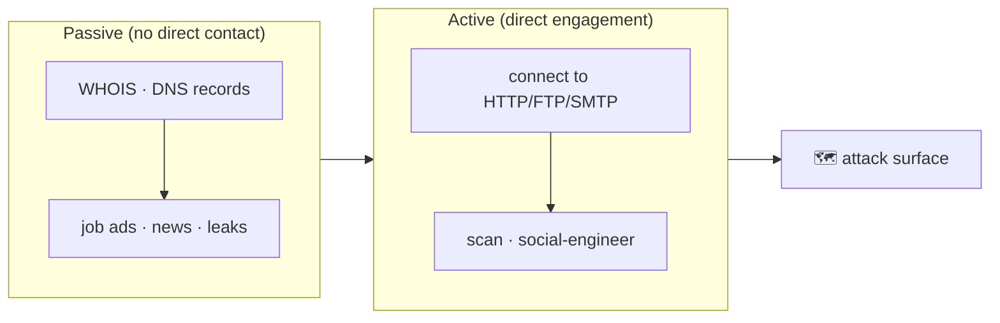

# 📡 2.6 Network Attacks & Recon Masterclass

> [!abstract] The Masterclass
> Map the terrain, then strike the services. This chapter is the offensive-networking half of Phase 2: passive & active **reconnaissance**, **OSINT**, the full **Nmap** host-discovery and port-scanning arsenal (including stealth/evasion), the common **protocols & servers** you'll enumerate, and the **attacks** against them (sniffing, MITM, password attacks). Builds on the **Networking Masterclass**. **`#level/operator`**

> [!warning] Authorized Simulation context
> Every scan, capture, and attack here is an **authorized red-team simulation / vulnerability assessment** against in-scope systems. Each technique notes the defensive signal it produces.

> [!tip] Chapter Map
> **** · **** · **** · **** · **** · ****

---

## Reconnaissance (Passive & Active)

Recon is the preliminary survey to gather target information — the first step of the **Unified Kill Chain** toward an initial foothold. Two modes:



![[Pasted image 20260119213253.png]]

**Passive** relies on publicly available knowledge — you observe from afar without touching the target:
- **WHOIS** (RFC 3912, TCP 43) — registrar, registrant contact, creation/expiry dates, name servers:
  ```bash
  whois example.com
  ```
- **nslookup** — resolve names to IPs; `nslookup -type=MX example.com 1.1.1.1` (public resolvers: Cloudflare `1.1.1.1`, Google `8.8.8.8`, Quad9 `9.9.9.9`).
- **dig** — richer DNS queries: `dig @8.8.8.8 example.com MX +short`.

![[Pasted image 20260119213316.png]]

**Active** requires direct engagement (and thus authorization) — connecting to servers, scanning, or social-engineering. Browser aids that straddle both: **FoxyProxy** (fast proxy switching for **Burp**), **User-Agent Switcher**, **Wappalyzer** (tech fingerprinting).

---

## OSINT & Google Dorking

**OSINT** collects intelligence from public sources — the passive-recon deep-dive. **Google Dorking** uses advanced operators to surface unintended exposure:

| Operator | Finds |
| --- | --- |
| `site:` | pages on one domain |
| `filetype:` / `ext:` | leaked PDFs, `.sql`, `.env`, `.log` |
| `intitle:` / `inurl:` | `"index of"`, `admin` panels |
| `intext:` | `"password"` in body |
| `"..."` `-x` `OR` `*` `..` | phrase / exclude / alternatives / wildcard / range |

```text
site:target.com filetype:pdf                 # leaked documents
site:target.com inurl:admin                    # admin panels
intitle:"index of" "config.php"                # exposed configs
```
The **[Google Hacking Database (GHDB)](https://www.exploit-db.com/google-hacking-database)** is a categorised library. **Well-known files** (`robots.txt`, `sitemap.xml`, `.git/`, `.env`, `security.txt`, `humans.txt`) leak structure and secrets. **Toolbox:** `theHarvester` (emails/subdomains), `exiftool` (document/image metadata), Shodan/Censys (internet-exposed services), the Wayback Machine, `gitleaks`/`trufflehog` (repo secrets). Feeds **subdomain enumeration** and **phishing** pretexts.

> **Defenders:** minimise metadata, scan repos for secrets, block web access to `.git`/`.env`, treat job ads/`humans.txt` as intel an attacker *will* read.

---

## Nmap — Live Host Discovery

Before port-scanning, find *which hosts are alive*. Nmap's discovery methods, each suited to a network position:

| Method | Flag | How it works |
| --- | --- | --- |
| **ARP scan** | `-PR` | Same-subnet only; ARP query → a reply means "up" (the default on a LAN, very reliable) |
| **ICMP echo** | `-PE` | Classic ping; often blocked by host firewalls (default on Windows) |
| **ICMP timestamp / mask** | `-PP` / `-PM` | Alternatives when echo is filtered |
| **TCP SYN ping** | `-PS<ports>` | SYN to a port; SYN/ACK or RST = host up (`-PS80,443`) |
| **TCP ACK ping** | `-PA<ports>` | ACK packet; needs privilege |
| **UDP ping** | `-PU<ports>` | ICMP port-unreachable to a closed UDP port = host up |

```bash
sudo nmap -PR -sn 10.10.10.0/24        # ARP sweep, no port scan (-sn)
sudo nmap -PE -sn 10.10.10.0/24        # ICMP echo sweep
sudo nmap -PS22,80,443 -sn 10.10.10.0/24
```
`-sn` = host discovery only (skip port scan). `-n` skips reverse-DNS (faster, quieter); `-R` forces it. Remember: an **ARP query precedes everything** on the local subnet.

---

## Nmap — Port Scanning

A port is **open** (service listening), **closed** (reachable, nothing listening), or — because of firewalls — one of six states Nmap distinguishes:

| State | Meaning |
| --- | --- |
| **open** | a service is listening |
| **closed** | reachable, nothing listening (RST returned) |
| **filtered** | a firewall blocks the probe/response — Nmap can't tell |
| **unfiltered** | reachable but state unknown (ACK scan) |
| **open\|filtered** / **closed\|filtered** | ambiguous |

### TCP flags & scan types
Scans differ by which **TCP flags** they set (`URG ACK PSH RST SYN FIN`):

![[Pasted image 20260131145832.png]]

| Scan | Flag(s) | Notes |
| --- | --- | --- |
| **Connect** `-sT` | full 3-way handshake | no privilege needed; noisy (logged) |
| **SYN "stealth"** `-sS` | SYN, then RST | default for root; never completes handshake |
| **Null** `-sN` | none | open→no reply, closed→RST (evades some filters) |
| **FIN** `-sF` | FIN | same logic as null |
| **Xmas** `-sX` | FIN+PSH+URG | "lit up like a Christmas tree" |
| **Maimon** `-sM` | FIN+ACK | works only on some BSD stacks |
| **ACK** `-sA` | ACK | maps **firewall rules** (filtered vs unfiltered), not open ports |
| **Window** `-sW` | ACK | reads the TCP window field of RSTs |
| **UDP** `-sU` | — | closed→ICMP port-unreachable; slow, needs root |
| **Custom** `--scanflags` | any | e.g. `--scanflags RSTSYNFIN` |

![[Pasted image 20260131152331.png]]

### Stealth & evasion
```bash
nmap -S SPOOFED_IP -e eth0 -Pn target        # source-IP spoof (only if you can sniff replies)
nmap -D 10.10.0.1,10.10.0.2,RND,ME target     # decoys — hide your IP among many
nmap -f target                                 # fragment packets (8-byte); -ff for 16
nmap -sI ZOMBIE_IP target                      # idle/zombie scan — attribute the scan to a 3rd host
nmap --spoof-mac 0 target                      # random MAC (same subnet only)
```
The **idle (zombie) scan** is the stealthiest — it infers a target's port state purely from a third "idle" host's incrementing **IP ID**, so no packet ever appears to come from you:

![[Pasted image 20260131182133.png]]

### Service, OS detection & timing
```bash
sudo nmap -sS -sV -O -T4 target      # versions + OS; -sV forces a full handshake
nmap -sV --version-intensity 9 target
nmap -A target                        # aggressive: -sV -O --script=default --traceroute
nmap -p- -T4 target                   # all 65535 ports
```
`-T0`–`-T5` set timing (paranoid→insane); `--reason`, `-v/-vv`, `-d/-dd` add detail. Full option reference: **Networking (Nmap (Network Mapper))**.

> **Defenders:** port scans are noisy across many ports from one source — IDS/IPS, connection-rate limits, and default-deny **firewalls** catch them; `-T0`/idle scans are how attackers try to stay under thresholds.

---

## Common Protocols & Servers

A port identifies a network **service**. The essentials, and their cleartext/encrypted status:

| Protocol | Port | Use | Security |
| --- | --- | --- | --- |
| FTP / FTPS | 21 / 990 | file transfer | cleartext / TLS |
| SSH / SFTP | 22 | remote access, transfer | encrypted |
| Telnet | 23 | remote access | **cleartext (avoid)** |
| SMTP / SMTPS | 25 / 465 | email send (MTA) | cleartext / TLS |
| HTTP / HTTPS | 80 / 443 | web | cleartext / TLS |
| POP3 / POP3S | 110 / 995 | email fetch | cleartext / TLS |
| IMAP / IMAPS | 143 / 993 | email sync | cleartext / TLS |

Cleartext protocols can be *spoken by hand* with `telnet`/`nc` — invaluable for **banner grabbing** and manual enumeration:
```bash
telnet target 80                      # then: GET / HTTP/1.1  +  Host: x  (Enter twice)
nc target 25                           # SMTP: HELO x / VRFY root (user enumeration)
telnet target 21                       # FTP: USER frank / PASS ... / SYST / STAT
```
Email uses **MSA → MTA → MDA → MUA** (submission → transfer → delivery → client), mirroring a postal system:

![[Pasted image 20260201142624.png]]

---

## Protocol & Server Attacks

Because so many protocols are cleartext, they're subject to four classic attacks. Frame them against the **CIA** triad (Confidentiality, Integrity, Availability) — attacks cause **DAD** (Disclosure, Alteration, Destruction):

![[Pasted image 20260201171948.png]]

### Sniffing (packet capture) — breaks Confidentiality
Cleartext credentials/messages are readable by anyone capturing traffic (with root/admin on the NIC):
```bash
sudo tcpdump -i eth0 -A 'tcp port 21 or tcp port 110'   # FTP/POP3 creds in the clear
```
Tools: **tcpdump**, **Wireshark** (GUI), **tshark** (CLI). Wireshark **display filters** you'll use constantly:

| Filter | Shows |
| --- | --- |
| `http.request` | all HTTP requests |
| `tcp.flags.syn==1 && tcp.flags.ack==0` | SYN packets (scan/connection attempts) |
| `ftp \|\| pop \|\| imap \|\| smtp` | cleartext mail/transfer protocols |
| `tcp.port==80 && frame contains "password"` | creds in cleartext HTTP |
| `dns` | DNS queries (spot tunneling/exfil) |
| `ip.addr==10.10.10.5` | traffic to/from one host |

### Man-in-the-Middle (MITM) — breaks Integrity
The attacker sits between two parties and can **alter** messages (e.g. rewrite a `$20` transfer):

![[Pasted image 20260201174213.png]]

Any HTTP browsing is MITM-susceptible; tools: **Ettercap**, **Bettercap** (paired with **ARP spoofing**). Mitigation is **TLS** — PKI + trusted roots give authentication + encryption, defeating both sniffing and MITM:

![[Pasted image 20260201181040.png]]

### Password attacks — break authentication
Cleartext or weakly-protected logins fall to brute force with **Hydra** + a wordlist. **Mitigations:** password policy, **account lockout**, **throttling**, CAPTCHA, certificate auth (SSH keys), and ****2FA****.

---

## 🔗 Related Master Notes & Deep-Dives
- **1.1 Networking** — the protocol/model foundations
- **2.5 Tooling** · **2.1 Web Fundamentals** — tooling & web recon
- **2.7 Social Engineering and Phishing** — the human attack surface
- **2.8 Vulnerability Research** — turning a version into an exploit
- [[Recon & Social Engineering]] — domain hub
