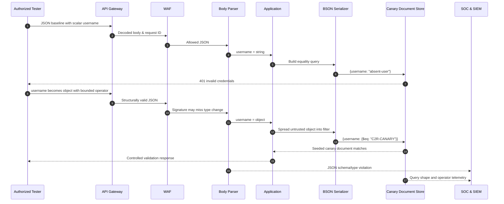

# NoSQL Injection

> [!warning] Authorized validation only
> Validate operator and type confusion only with synthetic documents in a controlled tenant. Do not enumerate production collections or execute server-side scripting.

## Core Vulnerability & Parser Mechanics (Zero)

NoSQL injection occurs when untrusted input changes the **structure or semantics of a database command** rather than remaining a scalar value. “NoSQL” is not one language: document stores, key-value stores, graph databases, and search engines expose different query models. The common defect is unsafe deserialization, object merging, operator acceptance, or string-built query expressions.

MongoDB-style document queries illustrate the issue. A safe authentication filter is conceptually `{username: Scalar("alice"), passwordHash: Scalar("...")}`. If a framework turns form keys such as `username[$ne]` into nested objects, the application may receive `{username: {$ne: null}}`. The database query parser treats `$ne` as an operator node, not as text. Both JSON values are syntactically valid, but their abstract query trees differ. The vulnerability therefore survives conventional quote escaping because no quote is required.

The data path is decisive: HTTP bytes become URL parameters or JSON; middleware applies bracket notation and type coercion; schema validation accepts or rejects objects; application code spreads or merges fields; a driver serializes the object to BSON; and the database command parser dispatches keys beginning with `$` as operators. A defense at only one stage can fail if another content type or legacy route follows a different path.

Common operator families include comparisons (`$eq`, `$ne`, `$gt`), membership (`$in`, `$nin`), pattern matching (`$regex`), logical composition (`$and`, `$or`, `$not`), and expression evaluation. Historical server-side JavaScript features such as `$where` create a particularly dangerous secondary interpreter and should be disabled or avoided. Regular-expression probes can become a blind prefix oracle, while catastrophic patterns can consume resources; authorized validation must use bounded, anchored expressions against canary data.

Type confusion is as important as operator injection. An endpoint designed for a string may accept an array, object, Boolean, or null. JavaScript truthiness, loose equality, schema defaults, and object-spread behavior may then alter authorization or query selection. Prototype-pollution concerns are related but distinct: they affect inherited application object properties before the database request is created. The report should identify the exact object received by the driver, not merely label every JSON anomaly “NoSQL injection.”

Safe construction combines strict schemas, scalar type checks, operator allowlists, and explicit query assembly. For a username, the accepted type should be a bounded string; objects and arrays should fail before database access. User-selectable filters should be translated from a small external vocabulary into fixed internal operators. Recursive key sanitization can add defense in depth, but stripping `$` or `.` characters alone is fragile if alternate encodings, nested arrays, or another datastore syntax remain.

## Visual Attack Flow



The security boundary is visible between scalar deserialization and operator-bearing object serialization. Capturing the application’s post-parse object and the database command shape is more conclusive than relying on a WAF signature.

## Weaponization & Practical Execution (Mastery)

### JSON type and operator validation

Baseline:

```http
POST /lab/directory/search HTTP/1.1
Host: api.example.test
Content-Type: application/json
Accept: application/json
X-Assessment-ID: C2R-NOSQL-008
Content-Length: 42

{"employeeCode":"definitely-not-present"}
```

```http
HTTP/1.1 200 OK
Content-Type: application/json
X-Request-ID: req-ns-101

{"count":0,"records":[]}
```

Bounded structural probe:

```http
POST /lab/directory/search HTTP/1.1
Host: api.example.test
Content-Type: application/json
Accept: application/json
X-Assessment-ID: C2R-NOSQL-008
Content-Length: 45

{"employeeCode":{"$eq":"C2R-CANARY"}}
```

```http
HTTP/1.1 200 OK
Content-Type: application/json
X-Request-ID: req-ns-102

{"count":1,"records":[{"employeeCode":"C2R-CANARY","synthetic":true}]}
```

An equivalent bracket-notation request may expose middleware behavior:

```http
POST /lab/directory/search HTTP/1.1
Host: api.example.test
Content-Type: application/x-www-form-urlencoded
X-Assessment-ID: C2R-NOSQL-008

employeeCode%5B%24eq%5D=C2R-CANARY
```

The server must reject both forms with a schema error such as:

```http
HTTP/1.1 400 Bad Request
Content-Type: application/problem+json

{"title":"Invalid request","errors":{"employeeCode":"must be a string"}}
```

### Bounded blind prefix analysis

In a dedicated fixture, an anchored regular expression can prove that an object is interpreted as an operator. This script checks only the known synthetic prefix and deliberately has no general extraction loop:

```python
import requests

URL = "https://api.example.test/lab/directory/search"
HEADERS = {"X-Assessment-ID": "C2R-NOSQL-008"}

def matches(prefix):
    body = {"employeeCode": {"$regex": "^" + prefix}}
    response = requests.post(URL, json=body, headers=HEADERS, timeout=3)
    response.raise_for_status()
    return response.json()["count"] == 1

for candidate in ["C", "C2", "C2R", "WRONG"]:
    print(candidate, matches(candidate))
```

```text
C True
C2 True
C2R True
WRONG False
scope guard: stopped after validating seeded prefix
```

For normalization testing, compare literal `$`, percent-encoded `%24` in form keys, double-encoded `%2524`, duplicate keys, and scalar/object changes. Unicode lookalikes should normally remain ordinary key characters; if a component normalizes them into `$`, document precisely where. WAF bypass is not the finding—the application’s willingness to accept an operator-bearing object is.

Root-cause remediation is a schema that rejects non-string `employeeCode`, explicit construction such as `{employeeCode: StringValidatedValue}`, no generic spread of request objects, disabled server-side scripting, and a least-privilege database role. Query allowlists should map supported filters to fixed driver expressions.

## Red Team OpSec & Impact

An internal assessment reviewed a Node.js employee directory after a gateway migration. The OpenAPI document declared `employeeCode` as a string, but the route did not execute runtime schema validation. A baseline unknown code returned zero records. Supplying an object with `$eq` returned the seeded `C2R-CANARY` record, proving that the application spread the parsed body directly into a MongoDB filter. The team did not test `$ne` against authentication, broad regular expressions, or server-side JavaScript because the canary established the root cause.

The edge WAF logged ordinary JSON and assigned a low anomaly score. Application telemetry, however, showed `employeeCode.type=object` where the route contract expected `string`. The strongest detection is therefore schema-aware: alert on scalar-to-object or scalar-to-array changes for stable fields, keys beginning with `$`, nested depth outside the route model, repeated anchored regular-expression probes, and database commands whose query shape differs from the application’s approved templates. Useful fields are principal, route, content type, parsed field types, recursive key names, request ID, database collection, query-shape hash, result count, and latency.

The SOC correlated three requests from one assessment identity: an absent scalar, an operator object, and an anchored regex. The database audit showed the same collection but three different command shapes. This distinction prevents a weak rule that simply flags dollar signs in any JSON, which would create noise in financial or templating data. Defenders should redact values while retaining type and operator metadata.

The engineering team added runtime JSON Schema validation at the route, constructed filters field by field, disabled unused JavaScript evaluation, and tested JSON, form, and duplicate-key variants. Purple-team replay confirmed that operator objects now receive HTTP 400 before a database span is created. The detection remains enabled because alternate endpoints and future regressions can reintroduce unsafe object construction.

---
> 🔼 Up: [[Web Injection Testing]]
