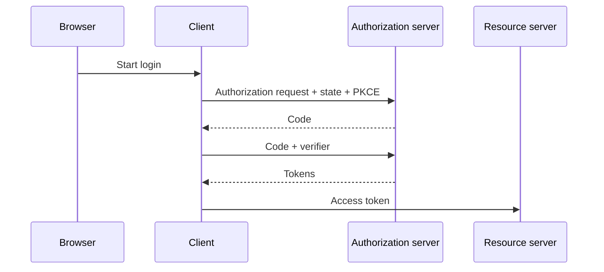
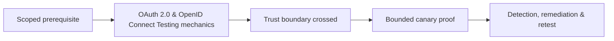

# OAuth 2.0 & OpenID Connect Testing

OAuth delegates authorization; OpenID Connect adds authentication and identity claims. Model client, authorization server, resource server, browser, redirect URIs, tokens, scopes, state, nonce, and PKCE.



Test exact redirect matching, state binding, nonce, PKCE, code reuse, client confusion, issuer/audience, token substitution, scope escalation, account linking, consent, refresh rotation, logout, discovery metadata, and key handling. Use test clients and identities.

```text
Expected: code bound to client, redirect, user session, PKCE verifier
Observed: code accepted by second client
Impact: authorization response mix-up
```

Remediate with standards-conformant libraries, exact redirects, PKCE, state/nonce, issuer/audience validation, secure token storage, narrow scopes, and rotation/revocation. Mastery lab: trace Authorization Code + PKCE and safely test each binding.

---
> 🔼 Up: [[Web Identity & Access Control]]

## Core Concept

**OAuth 2.0 & OpenID Connect Testing** is the atomic learning objective of this note. Identify its trust boundary, prerequisites, attacker-controlled input or state, vulnerable transformation, violated security invariant, minimum evidence, business consequence, and safe stopping point. The mechanism must remain explainable without depending on a specific product.

## Visual Attack Flow



## Practical Payloads & Execution

```http
POST /c2r-lab/oauth-2-0-openid-connect-testing HTTP/1.1
Host: app.example.test
Authorization: Bearer <CANARY_IDENTITY>
Content-Type: application/json

{"object":"C2R-CANARY","test":true}
```

### Expected output

```text
HTTP/1.1 200 OK
X-C2R-Result: vulnerable-condition-observed
{"marker":"C2R-CANARY-PROOF"}
```

Treat the output as proof of only the stated condition. Repeat with a negative control, preserve timestamps and the affected build, and never expand impact merely because another path appears reachable.

## Real-World Scenario

A multi-tenant enterprise service exposes a scoped **OAuth 2.0 & OpenID Connect Testing** condition to a synthetic customer account. The assessor proves one trust-boundary failure with a canary object, correlates application and identity telemetry, removes test state, and assigns the authoritative server-side control.

The durable remediation belongs at the authoritative enforcement layer. Retest the original condition and meaningful variants while verifying legitimate workflows still function.
