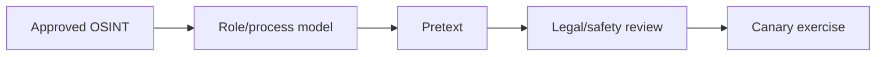
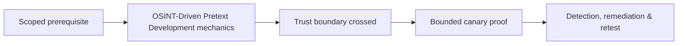

# OSINT-Driven Pretext Development

Pretexts use plausible business context while minimizing personal data and avoiding sensitive personal themes.



Define objective, target cohort, communication channel, claimed identity, expected verification process, prohibited themes, data handling, and exit. Mastery lab: create three pretexts from public corporate information and reject one for privacy or harm risk.

## Controlled pretext engineering

Start from a business process, not a person. Public job descriptions, supplier portals, conference agendas, press releases, technology vacancies, support hours, and organizational naming patterns can reveal how work normally arrives. Minimize collection: record the process cue and source URL, not a dossier of unrelated personal facts.

```text
Objective: test external collaboration-invite verification
Public cue: organization announced a new design partner
Claimed role: partner project coordinator
Requested action: open a harmless canary workspace
Expected defense: external-user label + known-channel confirmation
Abort: personal information disclosed or recipient shows distress
```

Score a pretext for plausibility, relevance to the threat model, required deception, privacy impact, potential distress, and reversibility. Legal and safety reviewers should reject themes involving health, family emergencies, layoffs, immigration, protected characteristics, or real compensation. Use synthetic identities and organization-controlled infrastructure. During execution, record which process cues carried trust and which controls interrupted the scenario. Retire the identity, domain, number, and landing page at exercise end.

---
> 🔼 Up: [[Human Factors & Pretext Development]]

## Core Concept

**OSINT-Driven Pretext Development** is the atomic learning objective of this note. Identify its trust boundary, prerequisites, attacker-controlled input or state, vulnerable transformation, violated security invariant, minimum evidence, business consequence, and safe stopping point. The mechanism must remain explainable without depending on a specific product.

## Visual Attack Flow



## Practical Payloads & Execution

```text
exercise=OSINT-Driven Pretext Development
cohort=privacy-approved canary group
maximum_action=harmless marker
real_credentials_collected=false
```

### Expected output

```text
prevented_or_reported=true
participant_harm=none
control_owner=identified
```

Treat the output as proof of only the stated condition. Repeat with a negative control, preserve timestamps and the affected build, and never expand impact merely because another path appears reachable.

## Real-World Scenario

A privacy-approved enterprise exercise applies **OSINT-Driven Pretext Development** with synthetic identities and a harmless canary action. Legal, HR, privacy, and the white team define prohibited themes and stop conditions; results measure process and control performance rather than individuals.

The durable remediation belongs at the authoritative enforcement layer. Retest the original condition and meaningful variants while verifying legitimate workflows still function.
