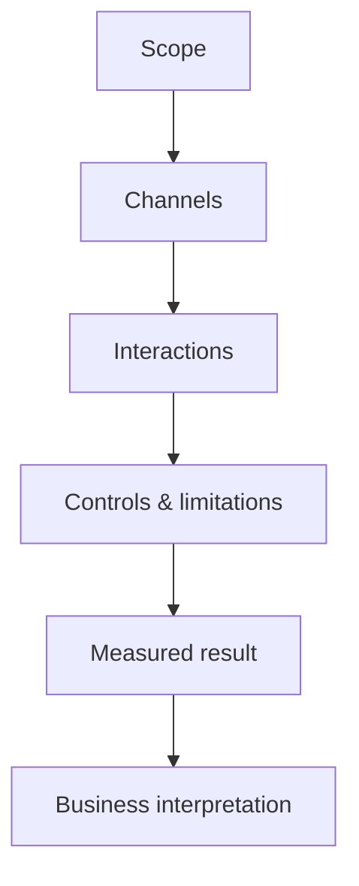
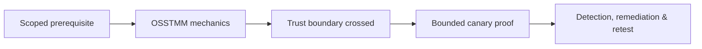

# OSSTMM

OSSTMM treats operational security as measurable interactions across human, physical, wireless, telecommunications, and data-network channels. Its value is disciplined scope and evidence; its metrics should supplement—not replace—business risk.



## Channel model

- Human: identity, process, trust, awareness.
- Physical: facilities, access controls, environmental boundaries.
- Wireless: radio trust and coverage.
- Telecommunications: voice and communication systems.
- Data networks: hosts, routes, services, and controls.

## Evidence discipline

Define what was visible, tested, blocked, inaccessible, or excluded. Separate absence of observation from proof of absence. A control can be present but ineffective, or effective from one vantage point and bypassed from another.

```text
Channel: Wireless
Vantage: approved parking-area coordinate
Interaction: passive beacon observation
Control: enterprise authentication + PMF
Limitation: no active disruption permitted
Result: two guest SSIDs extend beyond intended boundary
```

## Mastery exercise

Model one office across all five channels. Define interactions and controls, then explain how a strong data-network score can coexist with weak help-desk identity verification or physical access.

---
> 🔼 Up: [[Methodologies & Frameworks]]

## Core Concept

**OSSTMM** is the atomic learning objective of this note. Identify its trust boundary, prerequisites, attacker-controlled input or state, vulnerable transformation, violated security invariant, minimum evidence, business consequence, and safe stopping point. The mechanism must remain explainable without depending on a specific product.

## Visual Attack Flow



## Practical Payloads & Execution

```text
engagement_action=OSSTMM
asset=C2R-CANARY
identity=authorized-test-principal
impact_ceiling=single synthetic proof
```

### Expected output

```text
expected_output=C2R_CANARY_PROOF
cleanup=verified
retest_condition=recorded
```

Treat the output as proof of only the stated condition. Repeat with a negative control, preserve timestamps and the affected build, and never expand impact merely because another path appears reachable.

## Real-World Scenario

A regulated enterprise assessment applies **OSSTMM** to a canary asset. Scope, evidence provenance, decision points, control outcomes, cleanup, ownership, and retest criteria are recorded so another qualified operator can reproduce the conclusion.

The durable remediation belongs at the authoritative enforcement layer. Retest the original condition and meaningful variants while verifying legitimate workflows still function.
