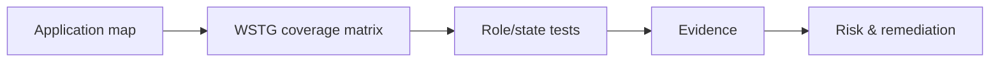
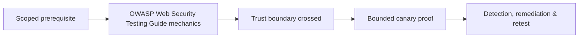

# OWASP Web Security Testing Guide

The WSTG is a structured catalogue of web-testing objectives covering information gathering, configuration, identity, authentication, authorization, sessions, input validation, error handling, cryptography, business logic, client-side behavior, and APIs.



## Use it correctly

Create a matrix linking WSTG identifiers to application components, roles, test data, status, evidence, and limitations. Do not claim “OWASP tested” because an automated scanner ran. Business-specific workflows, native/mobile clients, queues, cloud services, and third-party identity require extensions beyond the guide.

```text
WSTG objective: Authorization testing
Component: /api/v1/invoices/{id}
Roles: tenant-A user, tenant-B user, tenant-A admin
Actions: list, read, update, delete, export
Evidence: sanitized request/response IDs
Status: confirmed isolation except export
```

## Test sequencing

Map first, establish baseline, test identity/session, then authorization and input boundaries. Later tests depend on earlier context: an injection response means little if the endpoint belongs to a different tenant or asynchronous worker.

## Mastery exercise

Build a WSTG coverage matrix for a multi-role application. Include untested objectives and reasons. Select one objective from each major category and produce reproducible evidence, root cause, remediation, and retest.

---
> 🔼 Up: [[Methodologies & Frameworks]]

## Core Concept

**OWASP Web Security Testing Guide** is the atomic learning objective of this note. Identify its trust boundary, prerequisites, attacker-controlled input or state, vulnerable transformation, violated security invariant, minimum evidence, business consequence, and safe stopping point. The mechanism must remain explainable without depending on a specific product.

## Visual Attack Flow



## Practical Payloads & Execution

```text
engagement_action=OWASP Web Security Testing Guide
asset=C2R-CANARY
identity=authorized-test-principal
impact_ceiling=single synthetic proof
```

### Expected output

```text
expected_output=C2R_CANARY_PROOF
cleanup=verified
retest_condition=recorded
```

Treat the output as proof of only the stated condition. Repeat with a negative control, preserve timestamps and the affected build, and never expand impact merely because another path appears reachable.

## Real-World Scenario

A regulated enterprise assessment applies **OWASP Web Security Testing Guide** to a canary asset. Scope, evidence provenance, decision points, control outcomes, cleanup, ownership, and retest criteria are recorded so another qualified operator can reproduce the conclusion.

The durable remediation belongs at the authoritative enforcement layer. Retest the original condition and meaningful variants while verifying legitimate workflows still function.
