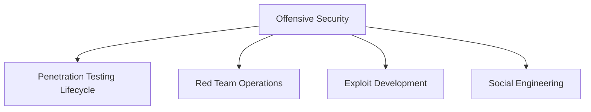

# ⚔️ Offensive Security

> [!abstract] The Domain
> The attacker's craft — methodology, recon, exploitation, and total root control. Authorized simulation only. Part of the domain map at [[Cyber Security]].

## Core pillars



- [[Penetration Testing]]
- [[Red Team Operations]]
- [[Exploit Development]]
- [[Social Engineering]]

```text
Authorized assessment -> measured evidence -> bounded impact -> cleanup -> remediation validation
```

---
> 🌐 Back to the domain map: [[Cyber Security]]
