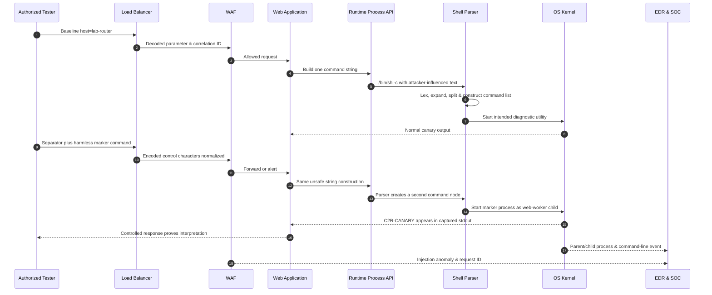

# Operating System Command Injection

> [!warning] Authorized validation only
> The examples use harmless canary output or short bounded delays in a deliberately vulnerable laboratory route. Do not launch shells, fetch payloads, alter files, establish persistence, or test production hosts without explicit written authorization.

## Core Vulnerability & Parser Mechanics (Zero)

Operating system command injection occurs when application data becomes part of a command language interpreted by a shell or command processor. The root cause is not simply “special characters.” It is the selection of an execution API that asks an interpreter to parse a combined string, followed by failure to preserve the boundary between the intended executable and untrusted arguments.

There are two materially different execution models. In a direct process API, the application supplies an executable path and an argument vector: conceptually `execve("/usr/bin/dig", ["dig", userValue], env)`. The kernel does not interpret pipes, semicolons, substitutions, redirects, or wildcard characters; they are ordinary bytes in one argument. In a shell model such as `/bin/sh -c "dig " + userValue`, the shell performs lexical analysis, quote removal, parameter expansion, command substitution, field splitting, pathname expansion, redirection, pipeline construction, and command dispatch. An input delimiter can end the intended command and introduce another grammar node.

On POSIX systems, important syntactic classes include sequential separators (`;` and newline), conditional lists (`&&`, `||`), pipelines (`|`), background control (`&`), redirections, command substitution, variable expansion, and globbing. Their exact behavior depends on the invoked shell; `/bin/sh` may be `dash`, `bash`, or another implementation. Space filters are not a security boundary because token boundaries can arise from tabs, newlines, shell expansion, or preexisting syntax. Quote escaping is context-sensitive: characters safe inside single quotes differ from those inside double quotes or an unquoted word.

Windows has separate interpreters. `cmd.exe /c` uses metacharacters such as `&`, `|`, parentheses, percent-variable expansion, and caret escaping. PowerShell parses tokens, expressions, pipelines, subexpressions, and .NET invocations with different quoting rules. Passing an untrusted value through several layers—JSON, PowerShell, `cmd.exe`, then a utility—creates nested grammars where escaping for one layer can be undone or reinterpreted by the next.

Command injection must be distinguished from **argument injection**. A direct process call can avoid shell syntax yet still let a value beginning with `-` select a dangerous program option. A safe implementation therefore uses an absolute executable, an argument array, strict validation, and `--` where the utility supports end-of-options. Environment variables, current working directory, executable search path, inherited file descriptors, and process privileges also influence impact. A web worker should never run with administrative privileges merely because shell injection has been “filtered.”

Blind command injection exists when stdout and stderr are not included in the HTTP response. A bounded delay or unique canary observable in approved telemetry can prove execution. Timing must be calibrated because queueing, DNS, caches, and autoscaling produce natural variance. The validator compares baseline, true control, and negative control across multiple samples and stops once a synthetic signal is established.

## Visual Attack Flow



The decisive evidence is a child process or bounded output that cannot be produced by the intended utility, joined to the HTTP request ID. A blocked WAF request alone does not prove the application is vulnerable.

## Weaponization & Practical Execution (Mastery)

### Output-bearing laboratory validation

Baseline:

```http
POST /lab/network/lookup HTTP/1.1
Host: ops.example.test
Content-Type: application/x-www-form-urlencoded
X-Assessment-ID: C2R-CMD-011

host=lab-router.example.test
```

```http
HTTP/1.1 200 OK
Content-Type: text/plain

Name: lab-router.example.test
Address: 192.0.2.40
```

Harmless marker probe, where `%3B` is `;` and `%20` is space:

```http
POST /lab/network/lookup HTTP/1.1
Host: ops.example.test
Content-Type: application/x-www-form-urlencoded
X-Assessment-ID: C2R-CMD-011

host=lab-router.example.test%3B%20printf%20C2R-CANARY
```

```http
HTTP/1.1 200 OK
Content-Type: text/plain
X-Request-ID: req-cmd-731

Name: lab-router.example.test
Address: 192.0.2.40
C2R-CANARY
```

The laboratory application trace explains the grammar transition:

```text
unsafe_source: /usr/bin/host lab-router.example.test; printf C2R-CANARY
shell_argv:    ["/bin/sh", "-c", "..."]
process_tree:  web-worker(1882) -> sh(1920) -> host(1921)
                                      \-> printf(1922)
exit_status:   0
```

In an output-blind fixture, use a maximum two-second delay only if the rules of engagement permit it. Five baseline and five probe requests are compared with a threshold above measured jitter:

```python
import statistics, time, requests

URL = "https://ops.example.test/lab/network/lookup"
HEADERS = {"X-Assessment-ID": "C2R-CMD-011"}

def median_for(value):
    times = []
    for _ in range(5):
        start = time.monotonic()
        requests.post(URL, data={"host": value}, headers=HEADERS, timeout=5)
        times.append(time.monotonic() - start)
    return statistics.median(times), times

baseline, raw_base = median_for("lab-router.example.test")
probe, raw_probe = median_for("lab-router.example.test; sleep 2")
print("baseline", round(baseline, 3), raw_base)
print("probe", round(probe, 3), raw_probe)
print("validated", probe - baseline > 1.5)
```

```text
baseline 0.083 [0.079, 0.082, 0.083, 0.087, 0.091]
probe    2.091 [2.087, 2.088, 2.091, 2.095, 2.099]
validated True
```

Encoding tests answer where interpretation changes. Compare `%3B`, `%253B`, literal newline versus `%0A`, JSON strings, and Unicode whitespace only in a canary route. If the gateway decodes once and the framework decodes twice, record both representations. Do not publish long evasion strings as remediation guidance; the fix is to remove the interpreter, not blacklist separators.

The secure implementation uses an absolute executable and argument vector, validates the hostname with a strict parser, rejects leading options, applies timeout and resource limits, clears unnecessary environment variables, runs as a dedicated low-privilege identity, and captures only bounded output. If the task can be implemented with a library call rather than an external utility, remove process execution entirely.

## Red Team OpSec & Impact

During an authorized assessment of an operations portal, a DNS troubleshooting route returned the output of a system utility. An encoded semicolon followed by `printf C2R-CANARY` appended the marker to the response. The tester repeated the request once with a negative control, captured the process tree in the agreed lab replica, and stopped. Code review showed a convenience wrapper invoking `/bin/sh -c`; the application team had relied on a hostname regular expression that was applied before a second URL decode.

The WAF logged a command-injection category alert but assigned moderate confidence because semicolons were normal elsewhere in form data. Endpoint telemetry made the event conclusive: the web-worker created `sh`, which created both the intended lookup utility and an unexpected `printf` process. On Windows, equivalent detections should monitor process creation event 4688 or Sysmon event 1 for service processes launching `cmd.exe`, PowerShell, scripting engines, or unusual utilities. On Linux, auditd or EDR process-exec telemetry should join parent executable, child executable, UID, container, command-line hash, and request correlation ID.

A SIEM rule should correlate an edge request containing decoded command delimiters or anomalous control characters with a new child process from the application worker within several seconds. Additional indicators include deterministic two-second latency clusters, nonzero utility exit codes, stderr fragments, unexpected DNS or outbound connections, and a web identity invoking a shell. Store normalized features and a redacted command line; avoid exposing secrets in broad logs.

The remediation replaced the shell wrapper with a resolver library and removed process permissions from the container. Regression tests submit separators, newlines, option prefixes, duplicate parameters, alternate content types, and double encoding, verifying identical rejection before process creation. Purple-team replay confirmed HTTP 400 responses, no shell child events, and a retained WAF signal for visibility.

---
> 🔼 Up: [[Web Injection Testing]]
