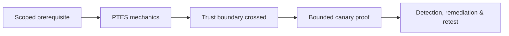

# PTES

The Penetration Testing Execution Standard organizes an engagement into pre-engagement interactions, intelligence gathering, threat modeling, vulnerability analysis, exploitation, post-exploitation, and reporting. It is a lifecycle scaffold—not permission to execute every technique.


## Enterprise application

Pre-engagement establishes scope, RoE, contacts, evidence, credentials, stop conditions, and reporting. Intelligence produces an asset/trust model. Threat modeling selects plausible adversaries and crown jewels. Vulnerability analysis creates hypotheses. Exploitation proves only the minimum impact. Post-exploitation measures trust paths under explicit authorization. Reporting translates evidence into remediation.

```text
PTES phase: Vulnerability Analysis
Input: confirmed service inventory
Decision: test exposed administrative interface
Safety boundary: test account, no configuration changes
Evidence: request ID, screenshot, server log correlation
Output: verified access-control finding
```

## Common failure

Teams often treat PTES as a linear checklist. Real engagements loop: a verified identity issue changes the threat model; a new asset returns to intelligence; a stop condition interrupts exploitation. Maintain a decision log explaining why each transition occurred.

## Mastery exercise

Design a PTES plan for an external assessment and an assumed-breach internal assessment. Compare inputs, prohibited actions, evidence, escalation path, and post-exploitation limits. A reviewer should be able to identify exactly which phase owns every artifact.

---
> 🔼 Up: [[Methodologies & Frameworks]]

## Core Concept

**PTES** is the atomic learning objective of this note. Identify its trust boundary, prerequisites, attacker-controlled input or state, vulnerable transformation, violated security invariant, minimum evidence, business consequence, and safe stopping point. The mechanism must remain explainable without depending on a specific product.

## Visual Attack Flow



## Practical Payloads & Execution

```text
engagement_action=PTES
asset=C2R-CANARY
identity=authorized-test-principal
impact_ceiling=single synthetic proof
```

### Expected output

```text
expected_output=C2R_CANARY_PROOF
cleanup=verified
retest_condition=recorded
```

Treat the output as proof of only the stated condition. Repeat with a negative control, preserve timestamps and the affected build, and never expand impact merely because another path appears reachable.

## Real-World Scenario

A regulated enterprise assessment applies **PTES** to a canary asset. Scope, evidence provenance, decision points, control outcomes, cleanup, ownership, and retest criteria are recorded so another qualified operator can reproduce the conclusion.

The durable remediation belongs at the authoritative enforcement layer. Retest the original condition and meaningful variants while verifying legitimate workflows still function.
