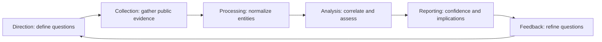
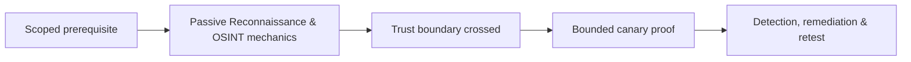

# Passive Reconnaissance & OSINT

> [!abstract] Methodology
> Passive reconnaissance constructs an evidence-backed model of an organization without intentionally probing its infrastructure. The objective is not to collect everything—it is to reduce uncertainty about ownership, exposure, trust relationships, technology, people, and likely attack paths before active testing begins.

> [!warning] Ethical boundary
> Public availability does not remove privacy, contractual, or data-protection duties. Collect only what answers an approved intelligence question, minimize personal data, never reuse exposed credentials, and protect evidence as client-confidential material.

## The intelligence cycle



An intelligence requirement should be answerable and tied to the engagement. Examples:

- Which internet-facing assets are probably owned or controlled by the client?
- Which subsidiaries, acquired brands, and third parties expand the attack surface?
- Which naming conventions reveal environments, regions, and business functions?
- Which technologies and identity providers are likely in use?
- Which public disclosures create credible initial-access hypotheses?

Without direction, OSINT becomes an uncontrolled data lake. With direction, every observation either raises confidence, contradicts an assumption, or creates a question for authorized validation.

## Evidence, provenance, and confidence

Every fact needs provenance:

| Field | Purpose |
|---|---|
| Source | Where the observation came from |
| Collection time | Public infrastructure changes quickly |
| Observed value | The exact hostname, prefix, certificate name, or statement |
| Ownership hypothesis | Why it might belong to the target |
| Confidence | Low, medium, or high with justification |
| Scope status | In scope, excluded, unknown, or awaiting confirmation |
| Next question | What controlled validation would resolve uncertainty |

Use at least two independent sources for high-impact claims. Ten sites repeating one underlying dataset are not ten independent confirmations.

## Search-engine reconnaissance

Search engines expose indexed documents, forgotten subdomains, login portals, historical pages, cached references, and file metadata. Query logic typically constrains:

- Site or domain.
- File type.
- Words in a title, URL, or page body.
- Excluded terms.
- Exact phrases and combinations.

The methodology is iterative: begin broad, identify naming patterns, search those patterns across alternate domains, then compare results across engines with different indexes. A result is a lead—not proof that the resource is live, owned, vulnerable, or in scope.

Documents can reveal employee names, internal paths, software versions, printers, business units, and project vocabulary. Extract only metadata needed for the assessment and avoid retaining unnecessary document content.

## Domain, registration, and network ownership

Registration records and structured registration data can establish creation dates, registrars, authoritative name servers, and organizational relationships. Privacy redaction is normal. Historical records are valuable for detecting mergers, rebranding, and infrastructure that moved providers.

Network ownership adds another layer:

- **Autonomous System Numbers** identify routing organizations.
- **Announced prefixes** approximate network ranges under an ASN's control.
- **Route history** reveals changes in providers and ownership.
- **Reverse-IP relationships** suggest shared hosting but do not prove common ownership.

Cloud and CDN addresses often belong to the provider, not the client. Establish ownership through control-plane evidence, certificates, DNS, contractual confirmation, or client inventory before active testing.

## DNS as an organizational map

DNS is a distributed database of dependencies:

| Record family | Intelligence implication |
|---|---|
| Address records | Hosting location, CDN use, and address changes |
| Mail exchange | Mail provider, gateways, and regional routing |
| Name server | Authoritative provider and delegated zones |
| Text records | Mail policy, SaaS verification, federation relationships |
| Canonical names | Outsourced services and potentially abandoned dependencies |
| Start of authority | Zone authority and timing metadata |

Certificate Transparency adds historical and current certificate names. Passive DNS adds time-series resolution. Together they reveal hostnames that current authoritative DNS alone may not expose. Wildcards, stale certificates, parked domains, and shared infrastructure must be normalized before conclusions are drawn.

## Internet-wide observations

Internet-wide search datasets provide historical banners, certificate identities, ports, protocol metadata, and observation timestamps collected by third parties. Their value is strategic: they can reveal an exposed management interface without the tester touching it.

Their limitations are equally important:

- Results may be stale.
- A shared address may host many tenants.
- A reverse proxy may hide the origin.
- A banner may be customized or inaccurate.
- The observed service may have been patched or removed.

Record the observation as a time-bound hypothesis. Active validation belongs to a later, authorized phase.

## Corporate and human attack-surface analysis

Corporate recon connects business structure to technology:

- Subsidiaries, acquisitions, joint ventures, and legacy brands.
- Geographic offices and externally hosted business functions.
- Job advertisements revealing platforms, programming languages, identity systems, and security products.
- Public support, status, developer, supplier, and recruitment portals.
- Employee roles and public professional material relevant to likely workflows.
- Email-address patterns derived from multiple legitimate public examples.

The goal is not personal profiling. It is to understand organizational processes that create technical trust: help-desk identity proofing, invoice handling, supplier access, remote work, software development, and executive communications.

## Public code and build artifacts

Public repositories, package registries, container images, mobile applications, CI configuration, issue trackers, and commit history can expose:

- Internal hostnames and environment names.
- Cloud account identifiers and resource names.
- Build and deployment architecture.
- Dependencies and version constraints.
- Accidentally committed credentials or private material.

A potential secret must be handled as an incident, not an invitation to authenticate. Preserve the minimum proof, notify the designated contact, and recommend revocation, history cleanup, and log review. Deletion from the current branch does not remove forks, caches, CI artifacts, or historical commits.

## Breach and identity intelligence

Lawful breach-intelligence services can indicate whether corporate identities were exposed and whether credential-stuffing or targeted phishing risk has increased. Do not acquire illicit dumps or reproduce passwords in reports. Outcomes should drive defense: password reset, token invalidation, phishing-resistant MFA, monitoring, and user notification through approved channels.

## Correlation and graph analysis

Normalize observations into entities—organization, domain, hostname, address, certificate, ASN, employee role, repository, cloud service—and typed relationships between them. A graph helps identify:

- Single points of trust.
- Reused infrastructure across brands.
- Third-party concentration.
- Legacy assets disconnected from current inventories.
- Paths from public identity to authentication surface.

Graph density is not certainty. Each edge needs source and confidence.

## Deliverables

A mature passive-recon phase produces:

1. **Attack-surface register** — normalized assets, owners, evidence, confidence, scope state.
2. **Relationship model** — domains, networks, providers, identities, and trust dependencies.
3. **Change timeline** — historical names, addresses, certificates, and acquisitions.
4. **Validation queue** — prioritized questions for controlled active recon.
5. **Data-handling record** — what sensitive information was collected, retained, and reported.

The root-level operator can explain why each candidate exists, how reliable it is, what harm could result from testing it, and which next action would answer the question with the least risk.

---
> 🔼 Up: [[Reconnaissance & Attack Surface]]

## Core Concept

**Passive Reconnaissance & OSINT** is the atomic learning objective of this note. Identify its trust boundary, prerequisites, attacker-controlled input or state, vulnerable transformation, violated security invariant, minimum evidence, business consequence, and safe stopping point. The mechanism must remain explainable without depending on a specific product.

## Visual Attack Flow



## Practical Payloads & Execution

```text
target=198.51.100.20 or designated enterprise canary
identity=assessment-user
action=Passive Reconnaissance & OSINT
rate_and_scope=approved
```

### Expected output

```text
observable_result=C2R_CANARY_PROOF
unauthorized_targets=0
evidence_timestamp=recorded
```

Treat the output as proof of only the stated condition. Repeat with a negative control, preserve timestamps and the affected build, and never expand impact merely because another path appears reachable.

## Real-World Scenario

A scoped enterprise infrastructure assessment applies **Passive Reconnaissance & OSINT** only to documentation-range addresses and designated canary services. Activity is rate-limited, ownership is verified, protocol evidence is captured, and broad exploitation is explicitly avoided.

The durable remediation belongs at the authoritative enforcement layer. Retest the original condition and meaningful variants while verifying legitimate workflows still function.
