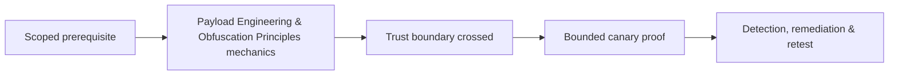

# Payload Engineering & Obfuscation Principles

Authorized payloads should be minimal, attributable, bounded, reversible, signed where possible, and designed for control measurement.


Encoding, packing, encryption, string transformation, entropy changes, and staging alter signatures but also reliability and observability. Use canary actions rather than weaponized capability. Define target identity, expiry, callback allowlist, maximum runtime, kill switch, audit, and self-cleanup.

Mastery lab: produce three harmless variants of one behavior and compare static, script, endpoint, and network detections without disabling controls.

## Engineering for bounded behavior

Begin with a capability manifest: exactly which input, output, filesystem, process, network, identity, and persistence behaviors are allowed. Refuse execution unless the engagement identifier, target identity, time window, signature, and environment guard all match. Apply maximum runtime, byte count, retry count, and destination allowlist in code—not merely operator guidance.

Obfuscation changes representation. Encoding is reversible formatting; encryption protects content with a key; packing transforms an executable container; staged delivery divides behavior; string or control-flow transformations alter static features. Each adds failure modes, supply-chain risk, entropy or memory anomalies, and cleanup obligations.

```text
variant A: readable signed canary
variant B: encoded configuration, same behavior
variant C: encrypted configuration with short-lived key
Compare: build reproducibility, static verdict, runtime events, network events
```

Use deterministic builds, dependency pinning, signing, hashes, software bills of materials, peer review, and isolated testing. Never copy unknown public payloads into a client environment. The most professional payload is the smallest artifact that answers the control question and can be conclusively disabled and removed.

---
> 🔼 Up: [[Evasion & Endpoint Tradecraft]]

## Core Concept

**Payload Engineering & Obfuscation Principles** is the atomic learning objective of this note. Identify its trust boundary, prerequisites, attacker-controlled input or state, vulnerable transformation, violated security invariant, minimum evidence, business consequence, and safe stopping point. The mechanism must remain explainable without depending on a specific product.

## Visual Attack Flow



## Practical Payloads & Execution

```text
operation_action=Payload Engineering & Obfuscation Principles
asset=C2R-CANARY
expiry=15 minutes
impact_ceiling=one synthetic proof
```

### Expected output

```text
objective=C2R_CANARY_PROOF
telemetry=correlated
cleanup=verified
```

Treat the output as proof of only the stated condition. Repeat with a negative control, preserve timestamps and the affected build, and never expand impact merely because another path appears reachable.

## Real-World Scenario

A threat-informed red-team exercise performs **Payload Engineering & Obfuscation Principles** on registered infrastructure and disposable assets. The action has an expiry, kill switch, impact ceiling, and telemetry objective; the team stops at proof and reconciles every artifact during teardown.

The durable remediation belongs at the authoritative enforcement layer. Retest the original condition and meaningful variants while verifying legitimate workflows still function.
