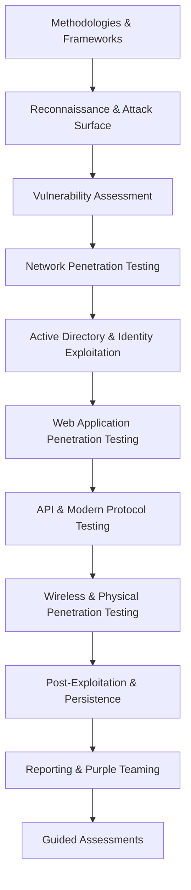

# Penetration Testing Lifecycle

> [!abstract] Major pillar of [[Offensive Security]]
> The complete enterprise assessment lifecycle. Methodology, evidence, and attack reasoning live here; product manuals and CLI references remain in **Tooling & Scripting**. Evasion and command-and-control remain exclusively in **Red Team Operations**.

## 🗺️ Zero-to-Mastery Learning Path

1. [[Methodologies & Frameworks]]
2. [[Reconnaissance & Attack Surface]]
3. [[Vulnerability Assessment]]
4. [[Network Penetration Testing]]
5. [[Active Directory & Identity Exploitation]]
6. [[Web Application Penetration Testing]]
7. [[API & Modern Protocol Testing]]
8. [[Wireless & Physical Penetration Testing]]
9. [[Post-Exploitation & Persistence]]
10. [[Reporting & Purple Teaming]]
11. [[Guided Assessments]]

---
> 🔼 Up: [[Offensive Security]]
