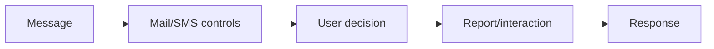

# Phishing & Messaging Security Testing

## 🗺️ Zero-to-Mastery Learning Path

1. [[Phishing & Spear-Phishing Methodology]]
2. [[Smishing, QR & Collaboration-Platform Testing]]

---
> 🔼 Up: [[Social Engineering]]
