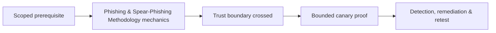

# Phishing & Spear-Phishing Methodology

Authorized phishing tests mail authentication, filtering, detonation, link/file controls, identity cues, user verification, reporting, SOC triage, and containment.


Use benign landing pages, no real credential collection, clear stop contacts, and rapid debrief. Metrics include delivery, control disposition, reporting rate/time, containment, and process gaps—not public click-rate shaming. Mastery lab: design broad and spear cohorts with equivalent safety and measurable controls.

## Campaign design

Define the threat behavior before drafting content. Broad phishing tests common delivery and reporting controls; spear-phishing tests whether business context and role targeting defeat them. Use controlled domains, authenticated mail where approved, unique campaign identifiers, a harmless destination, and an expiration mechanism. Seed indicators with the white cell so an accidental incident escalation can be deconflicted securely.

```text
Hypothesis: external file-share invitations bypass normal link inspection
Cohort: randomized, privacy-approved sample
Action ceiling: landing-page visit; no credential fields
Expected telemetry: gateway verdict, DNS, proxy, user report, SOC case
```

Analyze the full control chain: SPF/DKIM/DMARC alignment, reputation, content inspection, attachment detonation, URL rewriting, browser isolation, identity warnings, endpoint controls, reporting, triage, and containment. A blocked message is preventive-control evidence; a reported message is human-detection evidence. Preserve both. During debrief, teach the specific verification cue and reporting route. Remediate root causes such as weak supplier workflows or missing external labels, then retest with different language and timing.

---
> 🔼 Up: [[Phishing & Messaging Security Testing]]

## Core Concept

**Phishing & Spear-Phishing Methodology** is the atomic learning objective of this note. Identify its trust boundary, prerequisites, attacker-controlled input or state, vulnerable transformation, violated security invariant, minimum evidence, business consequence, and safe stopping point. The mechanism must remain explainable without depending on a specific product.

## Visual Attack Flow



## Practical Payloads & Execution

```text
exercise=Phishing & Spear-Phishing Methodology
cohort=privacy-approved canary group
maximum_action=harmless marker
real_credentials_collected=false
```

### Expected output

```text
prevented_or_reported=true
participant_harm=none
control_owner=identified
```

Treat the output as proof of only the stated condition. Repeat with a negative control, preserve timestamps and the affected build, and never expand impact merely because another path appears reachable.

## Real-World Scenario

A privacy-approved enterprise exercise applies **Phishing & Spear-Phishing Methodology** with synthetic identities and a harmless canary action. Legal, HR, privacy, and the white team define prohibited themes and stop conditions; results measure process and control performance rather than individuals.

The durable remediation belongs at the authoritative enforcement layer. Retest the original condition and meaningful variants while verifying legitimate workflows still function.
