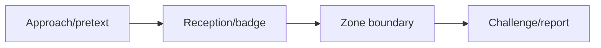

# Physical Social Engineering

## 🗺️ Zero-to-Mastery Learning Path

1. [[Tailgating, Facility & Visitor Process Testing]]
2. [[Removable Media & BadUSB Exercise Governance]]

---
> 🔼 Up: [[Social Engineering]]
