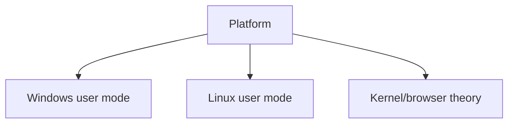

# Platform Exploitation

## 🗺️ Zero-to-Mastery Learning Path

1. [[Linux Exploit Development]]
2. [[Windows Exploit Development]]
3. [[Kernel Exploitation Theory]]
4. [[Browser Exploitation Theory]]

---
> 🔼 Up: [[Exploit Development]]
