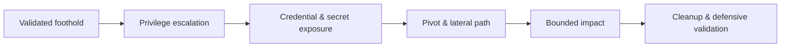

# Post-Exploitation & Persistence

> [!warning] Bounded impact only
> Stop when agreed impact is proven. Persistence, credential access, and collection require explicit RoE authorization and complete artifact tracking.

## 🗺️ Zero-to-Mastery Learning Path

1. [[Credential Access Testing]]
2. [[Secret Hunting]]
3. [[Linux Privilege Escalation Testing]]
4. [[Windows Privilege Escalation]]
5. [[Network Pivoting]]
6. [[Network Tunneling]]
7. [[Port Forwarding]]
8. [[Collection & Data Access Validation]]
9. [[Linux Persistence Testing]]
10. [[Windows Persistence Testing]]
11. [[Post-Exploitation Cleanup & Evidence]]

---
> 🔼 Up: [[Penetration Testing]]
