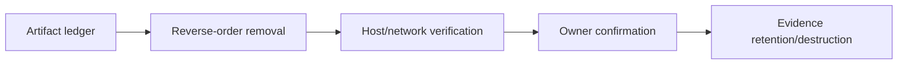
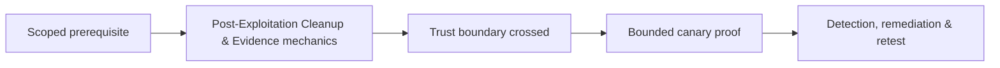

# Post-Exploitation Cleanup & Evidence

Cleanup is a planned phase with an artifact ledger, rollback procedure, independent verification, and incident path.



Track files, processes, services, tasks, accounts, memberships, keys, certificates, sessions, tunnels, routes, firewall changes, cloud resources, and test data. A successful removal command is not proof; query state, inspect telemetry, and obtain owner confirmation.

```text
artifact: canary scheduled task
created: 10:04Z
removed: 10:32Z
verification: task absent + no process/listener + owner confirmed
evidence: cleanup/F-12.json
```

If cleanup fails, stop, preserve evidence, notify contacts, and treat it as an engagement incident. Mastery lab: inject a mixed artifact set, interrupt cleanup halfway, resume from ledger, and prove final state.

---
> 🔼 Up: [[Post-Exploitation & Persistence]]

## Core Concept

**Post-Exploitation Cleanup & Evidence** is the atomic learning objective of this note. Identify its trust boundary, prerequisites, attacker-controlled input or state, vulnerable transformation, violated security invariant, minimum evidence, business consequence, and safe stopping point. The mechanism must remain explainable without depending on a specific product.

## Visual Attack Flow



## Practical Payloads & Execution

```text
fixture=Post-Exploitation Cleanup & Evidence
build=instrumented-debug
action=trigger minimized canary input
impact_ceiling=fixed marker or deterministic crash
```

### Expected output

```text
result=C2R_CANARY_PROOF
mitigation_state=recorded
production_boundary_crossed=false
```

Treat the output as proof of only the stated condition. Repeat with a negative control, preserve timestamps and the affected build, and never expand impact merely because another path appears reachable.

## Real-World Scenario

A vendor-owned instrumented build reproduces **Post-Exploitation Cleanup & Evidence**. The researcher demonstrates only a fixed marker or deterministic crash, records architecture and mitigation assumptions, patches the root defect, and retains the minimized input as a regression test.

The durable remediation belongs at the authoritative enforcement layer. Retest the original condition and meaningful variants while verifying legitimate workflows still function.
