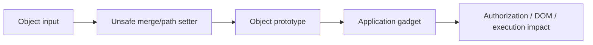
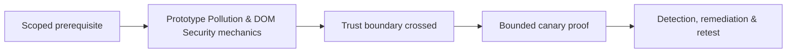

# Prototype Pollution & DOM Security

Prototype pollution occurs when attacker-controlled keys modify inherited JavaScript object properties. Impact depends on a gadget that consumes the polluted property.



Test query/body parsers, recursive merges, property setters, cloning, and server-side JavaScript. Look for `__proto__`, `constructor`, and `prototype` handling using harmless canary properties, then trace whether application logic observes them. DOM clobbering similarly abuses named elements and global resolution.

```javascript
const clean = {};
console.log(clean.c2rMarker); // must remain undefined
```

Remediate with safe libraries, key rejection at every nesting level, schema validation, null-prototype dictionaries where appropriate, own-property checks, and avoiding security decisions on inherited properties. Mastery lab: demonstrate pollution without impact, then a canary gadget, and fix both source and gadget.

---
> 🔼 Up: [[Client-Side Web Security]]

## Core Concept

**Prototype Pollution & DOM Security** is the atomic learning objective of this note. Identify its trust boundary, prerequisites, attacker-controlled input or state, vulnerable transformation, violated security invariant, minimum evidence, business consequence, and safe stopping point. The mechanism must remain explainable without depending on a specific product.

## Visual Attack Flow



## Practical Payloads & Execution

```http
POST /c2r-lab/prototype-pollution-dom-security HTTP/1.1
Host: app.example.test
Authorization: Bearer <CANARY_IDENTITY>
Content-Type: application/json

{"object":"C2R-CANARY","test":true}
```

### Expected output

```text
HTTP/1.1 200 OK
X-C2R-Result: vulnerable-condition-observed
{"marker":"C2R-CANARY-PROOF"}
```

Treat the output as proof of only the stated condition. Repeat with a negative control, preserve timestamps and the affected build, and never expand impact merely because another path appears reachable.

## Real-World Scenario

A multi-tenant enterprise service exposes a scoped **Prototype Pollution & DOM Security** condition to a synthetic customer account. The assessor proves one trust-boundary failure with a canary object, correlates application and identity telemetry, removes test state, and assigns the authoritative server-side control.

The durable remediation belongs at the authoritative enforcement layer. Retest the original condition and meaningful variants while verifying legitimate workflows still function.
