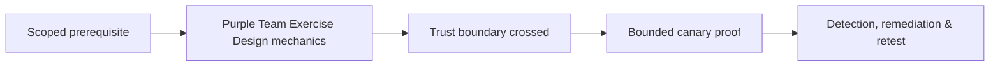

# Purple Team Exercise Design

Purple teaming is collaborative behavior validation: execute known canaries, observe controls, close telemetry/detection/response gaps, and rerun.


Define behavior, ATT&CK mapping, preconditions, canary assets, expected data sources, detection, response, safety, cleanup, and success criteria. Tools such as Atomic Red Team or Caldera belong in Tooling; methodology remains here.

```text
behavior: canary PowerShell child process
expected: endpoint process event + SIEM alert within 5 minutes
observed: telemetry present, rule field mismatch
action: normalize parent-image field; rerun passed
```

Mastery lab: design five tests spanning endpoint, identity, network, cloud, and application controls with measurable outcomes.

## Test card

For each behavior, define threat rationale, prerequisites, data sources, expected fields, prevention expectation, analytic logic, triage steps, safe emulation, negative control, cleanup, and pass criteria. Use one behavior per test card so failures can be localized.

```text
Behavior: unusual remote-management logon to canary server
Expected: identity event + network flow + destination process telemetry
Alert: source identity, source host, destination, protocol, process lineage
Negative control: approved administration from management subnet
Pass: correlated alert within 2 minutes; playbook identifies canary context
```

Run baseline, emulate, compare operator and defender timelines, classify the gap, tune, and rerun. Distinguish no event, collection failure, parser loss, enrichment failure, analytic miss, suppression, routing failure, and analyst-process failure. Version detections and monitor their data dependencies. Purple-team success is a durable operational control with an owner and recurring test—not a one-time alert screenshot.

---
> 🔼 Up: [[Reporting & Purple Teaming]]

## Core Concept

**Purple Team Exercise Design** is the atomic learning objective of this note. Identify its trust boundary, prerequisites, attacker-controlled input or state, vulnerable transformation, violated security invariant, minimum evidence, business consequence, and safe stopping point. The mechanism must remain explainable without depending on a specific product.

## Visual Attack Flow



## Practical Payloads & Execution

```text
engagement_action=Purple Team Exercise Design
asset=C2R-CANARY
identity=authorized-test-principal
impact_ceiling=single synthetic proof
```

### Expected output

```text
expected_output=C2R_CANARY_PROOF
cleanup=verified
retest_condition=recorded
```

Treat the output as proof of only the stated condition. Repeat with a negative control, preserve timestamps and the affected build, and never expand impact merely because another path appears reachable.

## Real-World Scenario

A regulated enterprise assessment applies **Purple Team Exercise Design** to a canary asset. Scope, evidence provenance, decision points, control outcomes, cleanup, ownership, and retest criteria are recorded so another qualified operator can reproduce the conclusion.

The durable remediation belongs at the authoritative enforcement layer. Retest the original condition and meaningful variants while verifying legitimate workflows still function.
