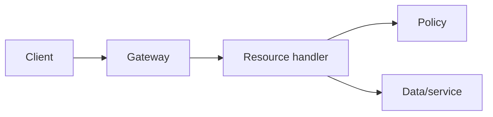
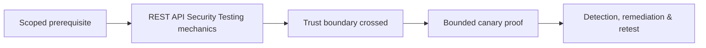

# REST API Security Testing

REST testing maps resources, methods, identities, media types, versions, pagination, filters, bulk operations, asynchronous jobs, and downstream trust.



Test object/function authorization, mass assignment, parameter pollution, method override, content-type confusion, schema validation, version drift, pagination limits, filtering, idempotency, rate limits, caching, errors, CORS, tokens, and webhooks. Use two tenants and canary objects.

```http
PATCH /api/v1/users/test-42 HTTP/1.1
Content-Type: application/json

{"displayName":"Canary","role":"administrator"}
```

Expected: unknown/non-writable `role` rejected. Remediate with strict schemas, explicit writable fields, centralized authorization, bounded queries, idempotency, and uniform gateway/origin policy. Mastery lab: derive tests from OpenAPI but also find undocumented and stateful behavior.

---
> 🔼 Up: [[API & Modern Protocol Testing]]

## Core Concept

**REST API Security Testing** is the atomic learning objective of this note. Identify its trust boundary, prerequisites, attacker-controlled input or state, vulnerable transformation, violated security invariant, minimum evidence, business consequence, and safe stopping point. The mechanism must remain explainable without depending on a specific product.

## Visual Attack Flow



## Practical Payloads & Execution

```http
POST /c2r-lab/rest-api-security-testing HTTP/1.1
Host: app.example.test
Authorization: Bearer <CANARY_IDENTITY>
Content-Type: application/json

{"object":"C2R-CANARY","test":true}
```

### Expected output

```text
HTTP/1.1 200 OK
X-C2R-Result: vulnerable-condition-observed
{"marker":"C2R-CANARY-PROOF"}
```

Treat the output as proof of only the stated condition. Repeat with a negative control, preserve timestamps and the affected build, and never expand impact merely because another path appears reachable.

## Real-World Scenario

A multi-tenant enterprise service exposes a scoped **REST API Security Testing** condition to a synthetic customer account. The assessor proves one trust-boundary failure with a canary object, correlates application and identity telemetry, removes test state, and assigns the authoritative server-side control.

The durable remediation belongs at the authoritative enforcement layer. Retest the original condition and meaningful variants while verifying legitimate workflows still function.
