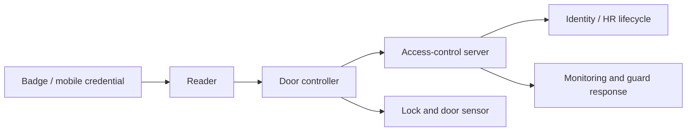

# RFID & Physical Access Testing

> [!abstract] Enterprise methodology
> Physical-access testing evaluates badge technology, enrollment, reader/controller trust, anti-passback, visitor handling, tailgating resistance, alarm response, and how facility access connects to logical identity. Cloning tests use synthetic badges only.

> [!danger] Safety and legality
> Never copy employee credentials, enter unapproved areas, interfere with life-safety systems, or test emergency exits without facility authorization. Assign an escort, stop word, approved doors, synthetic badges, and emergency contacts.

## Access-control architecture



## Technology model

| Technology | Typical security concern |
|---|---|
| Low-frequency proximity | Static identifier, easy replay/cloning in weak deployments |
| High-frequency smart card | Security depends on mutual authentication and key management |
| NFC/mobile credential | Device trust, app lifecycle, relay resistance, backend authorization |
| Barcode/magnetic stripe | Copyability and weak visual/reader validation |
| Biometric factor | Template protection, liveness, fallback and privacy |

The visible card format does not prove the protocol or cryptography. Inventory reader model, credential family, frequency, controller, backend, and key-management ownership.

## Synthetic badge assessment

Create badges expressly for testing:

```text
Badge A: standard employee, building only
Badge B: contractor, weekdays 08:00–18:00
Badge C: revoked test identity
Badge D: privileged lab-zone access
```

Test enrollment, duplication detection, revocation latency, lost-card workflow, expiration, PIN/biometric combinations, and whether a copied identifier is sufficient without cryptographic authentication.

Representative reader evidence:

```text
2026-07-30T20:14:02Z Door=LAB-2 Badge=AUDIT-C Result=DENIED Reason=REVOKED
2026-07-30T20:14:17Z Door=LOBBY Badge=AUDIT-A Result=GRANTED
2026-07-30T20:15:03Z Door=LAB-2 Badge=AUDIT-A Result=DENIED Reason=NO_ACCESS
```

## Cloning and replay methodology

Only clone a synthetic test credential. The objective is to determine whether the system authenticates a static identifier or performs cryptographic challenge-response. If a duplicate is accepted, test whether backend analytics detect impossible travel, simultaneous use, or duplicate identifiers.

```mermaid
sequenceDiagram
    participant B as Test badge
    participant R as Reader
    participant C as Controller
    B->>R: Identifier or cryptographic response
    R->>C: Credential + reader + event
    C-->>R: Grant / deny
    Note over B,C: Static identifiers can be replayed; mutual authentication resists copying
```

## Physical-process testing

- Tailgating and piggybacking using approved scenarios.
- Reception identity verification and visitor badges.
- Door-held-open and forced-door alarms.
- Anti-passback and occupancy logic.
- Contractor/offboarding revocation.
- Server-room, network-closet, loading-dock, and roof access.
- Badge plus workstation identity correlation.
- Guard escalation and evidence preservation.

Never exploit politeness with uninformed vulnerable individuals. Use trained participants or approved broad exercises with safety controls.

## Findings and remediation

```text
Condition: revoked synthetic badge remained active for 47 minutes
Expected: revocation propagated within five minutes
Impact: offboarded identity could retain facility access
Root cause: branch controller sync interval and offline cache
Remediation: reduce sync interval; alert on stale controller; verify revocation SLA
```

Prefer cryptographic credentials, diversified keys, secure enrollment, rapid revocation, anti-passback, controller hardening, monitored door sensors, and lifecycle integration with HR/identity systems.

---
> 🔼 Up: [[Wireless & Physical Penetration Testing]]
