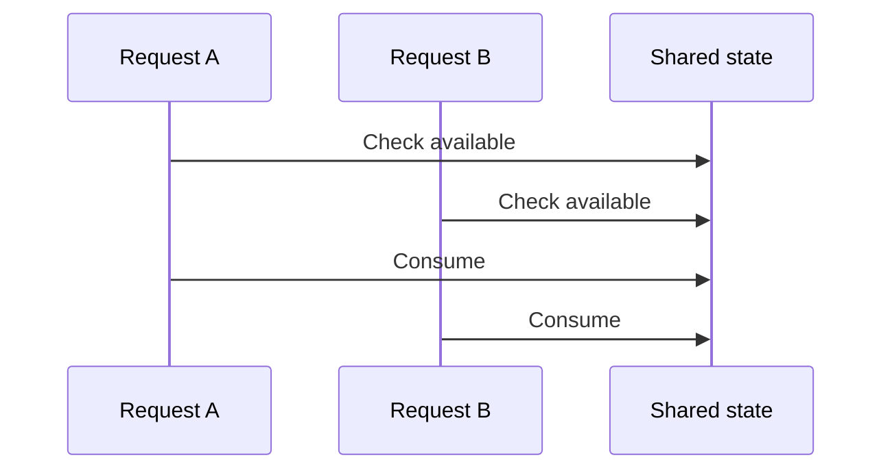
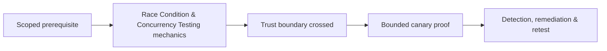

# Race Condition & Concurrency Testing

Race conditions appear when correctness depends on operation ordering without atomic enforcement. TOCTOU, duplicate redemption, double spending, limit bypass, and stale-state updates are common forms.



Use a canary object, establish sequential baseline, synchronize two or a few requests, capture monotonic timestamps/request IDs, and inspect final authoritative state. Do not load test production.

Remediate with database transactions, uniqueness, row/advisory locks, compare-and-swap versions, idempotency keys bound to principal and operation, and invariant checks inside the transaction.

Mastery lab: implement duplicate coupon and stale profile-update fixtures, prove the race with two requests, then verify transactional fixes under repeated controlled runs.

---
> 🔼 Up: [[Business Logic & Workflow Security]]

## Core Concept

**Race Condition & Concurrency Testing** is the atomic learning objective of this note. Identify its trust boundary, prerequisites, attacker-controlled input or state, vulnerable transformation, violated security invariant, minimum evidence, business consequence, and safe stopping point. The mechanism must remain explainable without depending on a specific product.

## Visual Attack Flow



## Practical Payloads & Execution

```http
POST /c2r-lab/race-condition-concurrency-testing HTTP/1.1
Host: app.example.test
Authorization: Bearer <CANARY_IDENTITY>
Content-Type: application/json

{"object":"C2R-CANARY","test":true}
```

### Expected output

```text
HTTP/1.1 200 OK
X-C2R-Result: vulnerable-condition-observed
{"marker":"C2R-CANARY-PROOF"}
```

Treat the output as proof of only the stated condition. Repeat with a negative control, preserve timestamps and the affected build, and never expand impact merely because another path appears reachable.

## Real-World Scenario

A multi-tenant enterprise service exposes a scoped **Race Condition & Concurrency Testing** condition to a synthetic customer account. The assessor proves one trust-boundary failure with a canary object, correlates application and identity telemetry, removes test state, and assigns the authoritative server-side control.

The durable remediation belongs at the authoritative enforcement layer. Retest the original condition and meaningful variants while verifying legitimate workflows still function.
