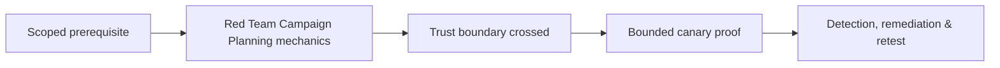

# Red Team Campaign Planning

Campaigns test detection and response against a defined threat profile, not arbitrary stealth. Define objectives, target assets, adversary behaviors, assumed access, injects, intelligence boundaries, safety, white team, deconfliction, stop conditions, scoring, and cleanup.


Use a behavior matrix mapped to expected telemetry and business objectives. Mastery lab: design a four-week campaign with two branches, one inject, daily deconfliction, and measurable blue-team outcomes.

## Campaign design package

Translate the threat profile into a small set of behavior hypotheses and observable objectives. Build multiple candidate paths so the campaign can adapt when a control works; a red team should record that prevention as a result rather than forcing the original script. For every phase, specify entry condition, action ceiling, expected telemetry, success evidence, cleanup, and decision owner.

```text
Objective: reach synthetic engineering canary from contractor access
Path A: federation → collaboration → managed endpoint
Path B: approved initial-access inject → internal identity
Control question: can defenders connect identity, endpoint and repository events?
Impact ceiling: canary metadata only
```

Use weekly campaign gates, daily deconfliction, immutable operator logs, infrastructure inventory, and a risk register. Define injects—assumed access or supplied artifacts—that preserve learning when an early preventive control blocks progress. Score objective attainment, prevention, telemetry completeness, detection, triage, containment, and recovery separately. The report must include paths not taken, because they reveal effective controls and the campaign’s decision logic.

---
> 🔼 Up: [[Red Team Planning & Initial Access]]

## Core Concept

**Red Team Campaign Planning** is the atomic learning objective of this note. Identify its trust boundary, prerequisites, attacker-controlled input or state, vulnerable transformation, violated security invariant, minimum evidence, business consequence, and safe stopping point. The mechanism must remain explainable without depending on a specific product.

## Visual Attack Flow



## Practical Payloads & Execution

```text
operation_action=Red Team Campaign Planning
asset=C2R-CANARY
expiry=15 minutes
impact_ceiling=one synthetic proof
```

### Expected output

```text
objective=C2R_CANARY_PROOF
telemetry=correlated
cleanup=verified
```

Treat the output as proof of only the stated condition. Repeat with a negative control, preserve timestamps and the affected build, and never expand impact merely because another path appears reachable.

## Real-World Scenario

A threat-informed red-team exercise performs **Red Team Campaign Planning** on registered infrastructure and disposable assets. The action has an expiry, kill switch, impact ceiling, and telemetry objective; the team stops at proof and reconciles every artifact during teardown.

The durable remediation belongs at the authoritative enforcement layer. Retest the original condition and meaningful variants while verifying legitimate workflows still function.
