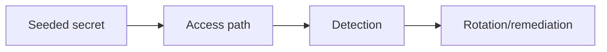
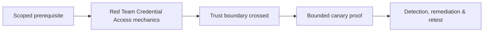

# Red Team Credential Access

Use seeded credentials and approved stores to validate memory, vault, file, token, service-account, cloud, and directory protections. Never retain real recovered secrets when metadata proves exposure.



Measure access prevention, sensor telemetry, identity alerting, secret scanning, and rotation. Mastery lab: place canaries in five stores and validate exposure plus response without displaying secret values.

## Secret exposure model

Inventory secret classes before testing: passwords, hashes, tickets, cookies, API keys, certificates, private keys, cloud tokens, service-account material, connection strings, backup credentials, and recovery codes. Map where each may exist—memory, browser, file, registry, vault, deployment variable, image, log, or metadata service—and which principal should read it.

```text
canary_id=SEC-014 type=api-token store=build-variable
authorized_reader=ci-service expected_alert=secret-read-by-user
proof=identifier + metadata only rotation_owner=platform-security
```

Use uniquely tagged canaries with no production authority. Validate process access, vault policy, export controls, endpoint telemetry, anomalous token use, and revocation workflow. If real material is encountered, stop viewing, avoid recording the value, isolate evidence access, and invoke the agreed notification and rotation process. Measure time from exposure to detection and from notification to invalidation. Remediation prioritizes reducing standing credentials, using hardware-backed or workload identity, narrowing scope, protecting memory, scanning repositories and artifacts, and making rotation routine.

---
> 🔼 Up: [[Lateral Operations & Objectives]]

## Core Concept

**Red Team Credential Access** is the atomic learning objective of this note. Identify its trust boundary, prerequisites, attacker-controlled input or state, vulnerable transformation, violated security invariant, minimum evidence, business consequence, and safe stopping point. The mechanism must remain explainable without depending on a specific product.

## Visual Attack Flow



## Practical Payloads & Execution

```text
operation_action=Red Team Credential Access
asset=C2R-CANARY
expiry=15 minutes
impact_ceiling=one synthetic proof
```

### Expected output

```text
objective=C2R_CANARY_PROOF
telemetry=correlated
cleanup=verified
```

Treat the output as proof of only the stated condition. Repeat with a negative control, preserve timestamps and the affected build, and never expand impact merely because another path appears reachable.

## Real-World Scenario

A threat-informed red-team exercise performs **Red Team Credential Access** on registered infrastructure and disposable assets. The action has an expiry, kill switch, impact ceiling, and telemetry objective; the team stops at proof and reconciles every artifact during teardown.

The durable remediation belongs at the authoritative enforcement layer. Retest the original condition and meaningful variants while verifying legitimate workflows still function.
