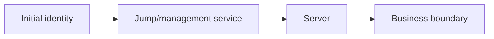
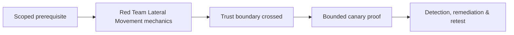

# Red Team Lateral Movement

Lateral movement validates identity and management trust using approved protocols, canary hosts, and one bounded path.



Compare SMB, WinRM, RDP, SSH, remote service/task, application administration, and cloud management by authentication, authorization, telemetry, and cleanup. Do not create uncontrolled propagation. Mastery lab: execute one canary path and require endpoint, network, identity, and SIEM correlation.

## Path validation

Represent lateral movement as identity + source + protocol + destination + resulting privilege. Verify each edge before use. A reachable port is not an authorization path, and an administrative group does not prove the credential is available or accepted under current policy.

```text
source=WKSTN-CANARY-01 identity=CORP\rt-user
protocol=WinRM destination=SRV-CANARY-02
expected=deny: role lacks remote-management right
telemetry=identity sign-in + network flow + endpoint process lineage
```

Prefer a dedicated management protocol and canary destination over creating a remote service or task. If an operation requires a change, record before-state, exact artifact, expiry, and rollback. Test segmentation, tier boundaries, local administrator uniqueness, service-account reach, delegation, firewall policy, and remote-management logging. Stop after the first bounded business boundary is crossed. Defensive validation should correlate the same event across source endpoint, destination endpoint, network, and identity planes and identify the earliest control that could have prevented the path.

---
> 🔼 Up: [[Lateral Operations & Objectives]]

## Core Concept

**Red Team Lateral Movement** is the atomic learning objective of this note. Identify its trust boundary, prerequisites, attacker-controlled input or state, vulnerable transformation, violated security invariant, minimum evidence, business consequence, and safe stopping point. The mechanism must remain explainable without depending on a specific product.

## Visual Attack FlowTARGETS=119




## Practical Payloads & Execution

```text
operation_action=Red Team Lateral Movement
asset=C2R-CANARY
expiry=15 minutes
impact_ceiling=one synthetic proof
```

### Expected output

```text
objective=C2R_CANARY_PROOF
telemetry=correlated
cleanup=verified
```

Treat the output as proof of only the stated condition. Repeat with a negative control, preserve timestamps and the affected build, and never expand impact merely because another path appears reachable.

## Real-World Scenario

A threat-informed red-team exercise performs **Red Team Lateral Movement** on registered infrastructure and disposable assets. The action has an expiry, kill switch, impact ceiling, and telemetry objective; the team stops at proof and reconciles every artifact during teardown.

The durable remediation belongs at the authoritative enforcement layer. Retest the original condition and meaningful variants while verifying legitimate workflows still function.
