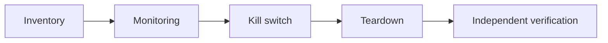
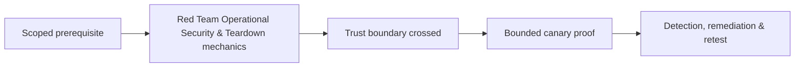

# Red Team Operational Security & Teardown

Operational security protects client data, infrastructure ownership, operator identities, and exercise boundaries. It is not evading client defenders outside the agreed scenario.



Track every domain, certificate, host, account, secret, agent, listener, route, and artifact. Rotate/revoke, delete resources, verify DNS/TLS expiry, reconcile billing, retain authorized audit, and document residual exposure. Mastery lab: execute teardown from a complete inventory after a simulated operator outage.

## Operational control model

Use dedicated identities, managed devices, encrypted evidence, least-privilege cloud projects, separate client workspaces, approved communications, and dual control for high-impact actions. Prevent cross-engagement contamination by never reusing payload identifiers, domains, credentials, storage, or result channels. Record provenance for every collected artifact and prohibit copying client data into personal notes or unmanaged analysis systems.

```text
asset_id,type,owner,created,expiry,kill_action,status
RT14-DNS-01,domain,infra-lead,2026-07-01,2026-08-05,remove-zone,active
RT14-ID-03,cloud-role,operator-a,2026-07-02,2026-07-31,revoke-trust,active
```

Assume an operator can become unavailable. Another authorized operator must be able to find ownership records, revoke access, stop agents, and complete cleanup without private knowledge. Perform periodic orphan checks during the campaign. Teardown uses four-way reconciliation: planned inventory, provider inventory, endpoint evidence, and client-owner confirmation. Retain only contractually authorized evidence; cryptographically destroy temporary keys and document residual items that cannot immediately be removed.

---
> 🔼 Up: [[C2 Infrastructure & Operational Security]]

## Core Concept

**Red Team Operational Security & Teardown** is the atomic learning objective of this note. Identify its trust boundary, prerequisites, attacker-controlled input or state, vulnerable transformation, violated security invariant, minimum evidence, business consequence, and safe stopping point. The mechanism must remain explainable without depending on a specific product.

## Visual Attack Flow



## Practical Payloads & Execution

```text
operation_action=Red Team Operational Security & Teardown
asset=C2R-CANARY
expiry=15 minutes
impact_ceiling=one synthetic proof
```

### Expected output

```text
objective=C2R_CANARY_PROOF
telemetry=correlated
cleanup=verified
```

Treat the output as proof of only the stated condition. Repeat with a negative control, preserve timestamps and the affected build, and never expand impact merely because another path appears reachable.

## Real-World Scenario

A threat-informed red-team exercise performs **Red Team Operational Security & Teardown** on registered infrastructure and disposable assets. The action has an expiry, kill switch, impact ceiling, and telemetry objective; the team stops at proof and reconciles every artifact during teardown.

The durable remediation belongs at the authoritative enforcement layer. Retest the original condition and meaningful variants while verifying legitimate workflows still function.
