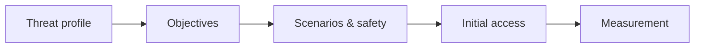

# Red Team Planning & Initial Access

```mermaid
flowchart LR
    T["Threat profile"] --> O["Objectives"]
    O --> S["Scenarios & safety"]
    S --> I["Initial access"]
    I --> M["Measurement"]
```

## 🗺️ Zero-to-Mastery Learning Path

1. [[Red Team Campaign Planning]]
2. [[Enterprise Initial Access Methodology]]

---
> 🔼 Up: [[Red Team Operations]]
