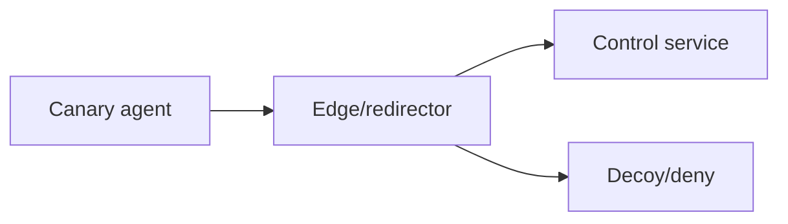
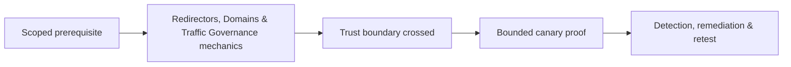

# Redirectors, Domains & Traffic Governance

Redirectors separate public ingress from control services and enforce source, path, method, rate, certificate, and shutdown policy.



Govern domain ownership, DNS, TLS, hosting authorization, logs, allowlists, egress, rate, provider terms, health, expiry, and teardown. Domain fronting and third-party trust abuse may violate providers and should not be assumed available. Mastery lab: deploy an auditable lab redirector and prove emergency shutdown.

## Layered ingress policy

A redirector should default-deny and forward only traffic that satisfies the operation’s agreed properties. Controls can include source ranges, mutual authentication, exact host and path, method, content type, request size, rate, time window, and signed agent metadata. Invalid traffic receives a harmless response or is dropped according to the safety design; it is never proxied to the control plane.

```text
Internet → authoritative DNS → edge TLS → policy filter → control service
                                     ↘ deny/decoy + audit
```

Maintain a ledger for registrant, registrar, DNS zone, hosting account, certificate, renewal date, purpose, data location, logging, owner, and destruction proof. Use separate credentials and projects per engagement. Monitor reputation and abuse reports because public infrastructure can affect unrelated users and providers. Emergency shutdown should work at multiple layers: disable route, revoke agent credentials, remove DNS, stop origin, and destroy secrets. After teardown, verify DNS propagation, certificate revocation or expiry, storage deletion, log retention, billing closure, and that no hostname resolves to recycled third-party infrastructure.

---
> 🔼 Up: [[C2 Infrastructure & Operational Security]]

## Core Concept

**Redirectors, Domains & Traffic Governance** is the atomic learning objective of this note. Identify its trust boundary, prerequisites, attacker-controlled input or state, vulnerable transformation, violated security invariant, minimum evidence, business consequence, and safe stopping point. The mechanism must remain explainable without depending on a specific product.

## Visual Attack Flow



## Practical Payloads & Execution

```text
operation_action=Redirectors, Domains & Traffic Governance
asset=C2R-CANARY
expiry=15 minutes
impact_ceiling=one synthetic proof
```

### Expected output

```text
objective=C2R_CANARY_PROOF
telemetry=correlated
cleanup=verified
```

Treat the output as proof of only the stated condition. Repeat with a negative control, preserve timestamps and the affected build, and never expand impact merely because another path appears reachable.

## Real-World Scenario

A threat-informed red-team exercise performs **Redirectors, Domains & Traffic Governance** on registered infrastructure and disposable assets. The action has an expiry, kill switch, impact ceiling, and telemetry objective; the team stops at proof and reconciles every artifact during teardown.

The durable remediation belongs at the authoritative enforcement layer. Retest the original condition and meaningful variants while verifying legitimate workflows still function.
