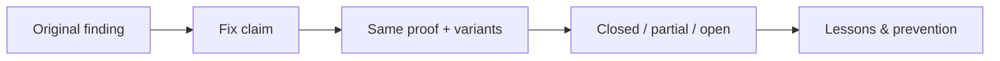
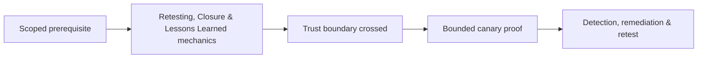

# Retesting, Closure & Lessons Learned

Retesting reproduces the original proof, tests adjacent variants, confirms root-cause remediation, and records residual risk.



Preserve original environment/version and evidence. A changed status code may hide the same side effect. Classify fixed, partially fixed, not fixed, not testable, risk accepted, or obsolete with rationale.

Closure includes artifact reconciliation, credentials/certificates rotation, evidence retention, final access review, urgent issue status, and retrospective. Mastery lab: retest one superficial patch and one root-cause patch, then write prevention actions for engineering and assurance.

## Closure discipline

Confirm the fixed build and affected asset before retesting. Reproduce the authorized baseline, repeat the original proof, test meaningful variants derived from the root cause, and run negative controls to ensure legitimate behavior remains. A changed error string or blocked payload does not prove a systemic repair.

Classify results as remediated, partially remediated, not remediated, risk accepted, or unable to verify. Attach exact environment, identity, timestamps, request identifiers, sanitized evidence, tested variants, and cleanup. If only some instances or paths are fixed, preserve the original finding and state the residual scope.

Lessons learned ask why the defect entered, escaped review, remained exposed, and was or was not detected. Convert the answers into reusable design standards, tests, CI policy, detection content, inventory improvements, and ownership changes. Track whether those systemic actions close—not just the individual ticket.

---
> 🔼 Up: [[Reporting & Purple Teaming]]

## Core Concept

**Retesting, Closure & Lessons Learned** is the atomic learning objective of this note. Identify its trust boundary, prerequisites, attacker-controlled input or state, vulnerable transformation, violated security invariant, minimum evidence, business consequence, and safe stopping point. The mechanism must remain explainable without depending on a specific product.

## Visual Attack Flow



## Practical Payloads & Execution

```text
engagement_action=Retesting, Closure & Lessons Learned
asset=C2R-CANARY
identity=authorized-test-principal
impact_ceiling=single synthetic proof
```

### Expected output

```text
expected_output=C2R_CANARY_PROOF
cleanup=verified
retest_condition=recorded
```

Treat the output as proof of only the stated condition. Repeat with a negative control, preserve timestamps and the affected build, and never expand impact merely because another path appears reachable.

## Real-World Scenario

A regulated enterprise assessment applies **Retesting, Closure & Lessons Learned** to a canary asset. Scope, evidence provenance, decision points, control outcomes, cleanup, ownership, and retest criteria are recorded so another qualified operator can reproduce the conclusion.

The durable remediation belongs at the authoritative enforcement layer. Retest the original condition and meaningful variants while verifying legitimate workflows still function.
