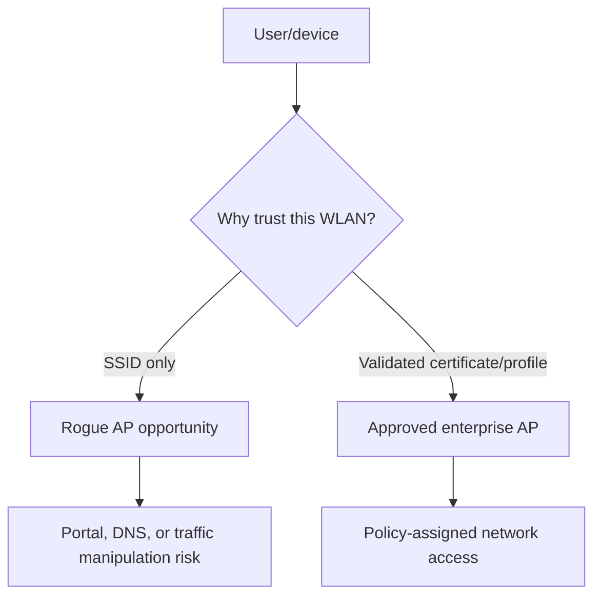
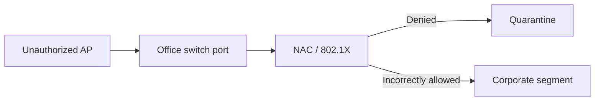

# Rogue Access Points & Wireless Trust

> [!abstract] Enterprise methodology
> Rogue-AP testing evaluates whether clients trust names instead of authenticated infrastructure, whether wired controls detect unauthorized radios, and whether identity, onboarding, and monitoring prevent a nearby attacker from becoming a network intermediary.

## Trust paths



## Rogue categories

- **Evil twin:** attacker-controlled AP imitates an approved SSID.
- **Unauthorized internal AP:** employee/device bridges the wired network to radio.
- **Misconfigured approved AP:** legitimate infrastructure advertises unsafe security.
- **Ad hoc/hotspot:** unmanaged peer or phone tethering bypasses policy.
- **Rogue client:** device associates with prohibited external networks.

## Test design

Use a dedicated test SSID/profile, synthetic identity, approved channel, low transmit power, and RF-contained location where possible. Never imitate a production SSID or collect credentials without explicit approval.

Document the expected control chain:

```text
1. Managed device receives signed WLAN profile
2. Device validates RADIUS server certificate and expected identity
3. Network-access control assigns role/VLAN
4. Wireless IDS detects unauthorized BSSID or wired rogue AP
5. SOC triages and facilities locates device
```

## Client trust assessment

Check whether managed clients:

- Autojoin by SSID alone.
- Validate certificate chain, name, and expected identity.
- Prefer stronger security over signal strength.
- Expose probe requests for hidden/preferred networks.
- Permit user-created profiles that override managed policy.
- Retain networks after offboarding.

Representative controlled observation:

```text
Test SSID: Corp-Audit
Managed profile expected server: radius.example.internal
Presented test certificate: untrusted audit CA
Expected: connection rejected
Observed: OS prompts user to accept certificate manually
Risk: user-mediated credential disclosure path
```

## Wired-side rogue AP

An unauthorized AP connected to an office port can bypass physical and network boundaries. Validate switch-port authentication, NAC, DHCP snooping, allowed-device policy, segmentation, and whether infrastructure detects a new bridge/MAC pattern.



## Detection exercise

Coordinate a time-boxed test with the SOC and wireless team. Measure:

- Detection latency.
- Correct classification and location.
- Correlation with switch and DHCP data.
- Analyst ability to distinguish sanctioned test infrastructure.
- Containment and escalation workflow.

Do not perform automated containment against unknown radios; neighboring businesses and personal devices may be lawful.

## Remediation

Deploy signed managed WLAN profiles, certificate-based EAP, strict server-name validation, PMF, 802.1X/NAC on wired ports, wireless intrusion monitoring, inventory reconciliation, and user training that explains certificate warnings rather than teaching users to click through them.

## Trust decision analysis

Clients may select networks by saved SSID, security type, signal, previous BSSID, enterprise profile, and platform policy. Test whether an enterprise profile pins authentication-server trust or merely trusts a broad public/private CA. Observe auto-join, transition-mode, captive portal, and fallback behavior with canary devices.

## Controlled rogue-AP design

Use shielded space or approved channels/power, unique test SSID unless an exact-name simulation is authorized, no Internet forwarding by default, canary credentials only, explicit source labeling, remote monitoring, and a physical kill switch. Capture association and authentication metadata without collecting unrelated user traffic.

```text
AP identifier: C2R-ROGUE-01
Location: RF enclosure
Channel/power: 36 / minimum
Clients: two inventory-tagged canaries
Credential policy: generated, single-use
Stop condition: unexpected client association
```

## Detection validation

Compare wireless-controller rogue detection, wired switch MAC/port data, DHCP, RADIUS, DNS, endpoint WLAN events, and physical inventory. Test unknown AP, known SSID from wrong BSSID, unauthorized bridge, and canary client association. Validate response ownership and containment procedure.

## Mastery lab

Create legitimate and controlled rogue APs, then explain client choice under secure enterprise profile, intentionally weak profile, and personal network. Demonstrate why signal strength alone is not identity. Remediate certificate validation/MDM profile and require failed association to the rogue fixture.

---
> 🔼 Up: [[Wireless & Physical Penetration Testing]]

## Core Concept

**Rogue Access Points & Wireless Trust** is the atomic learning objective of this note. Identify its trust boundary, prerequisites, attacker-controlled input or state, vulnerable transformation, violated security invariant, minimum evidence, business consequence, and safe stopping point. The mechanism must remain explainable without depending on a specific product.

## Visual Attack Flow


## Practical Payloads & Execution

```text
exercise=Rogue Access Points & Wireless Trust
cohort=privacy-approved canary group
maximum_action=harmless marker
real_credentials_collected=false
```

### Expected output

```text
prevented_or_reported=true
participant_harm=none
control_owner=identified
```

Treat the output as proof of only the stated condition. Repeat with a negative control, preserve timestamps and the affected build, and never expand impact merely because another path appears reachable.

## Real-World Scenario

A privacy-approved enterprise exercise applies **Rogue Access Points & Wireless Trust** with synthetic identities and a harmless canary action. Legal, HR, privacy, and the white team define prohibited themes and stop conditions; results measure process and control performance rather than individuals.

The durable remediation belongs at the authoritative enforcement layer. Retest the original condition and meaningful variants while verifying legitimate workflows still function.
