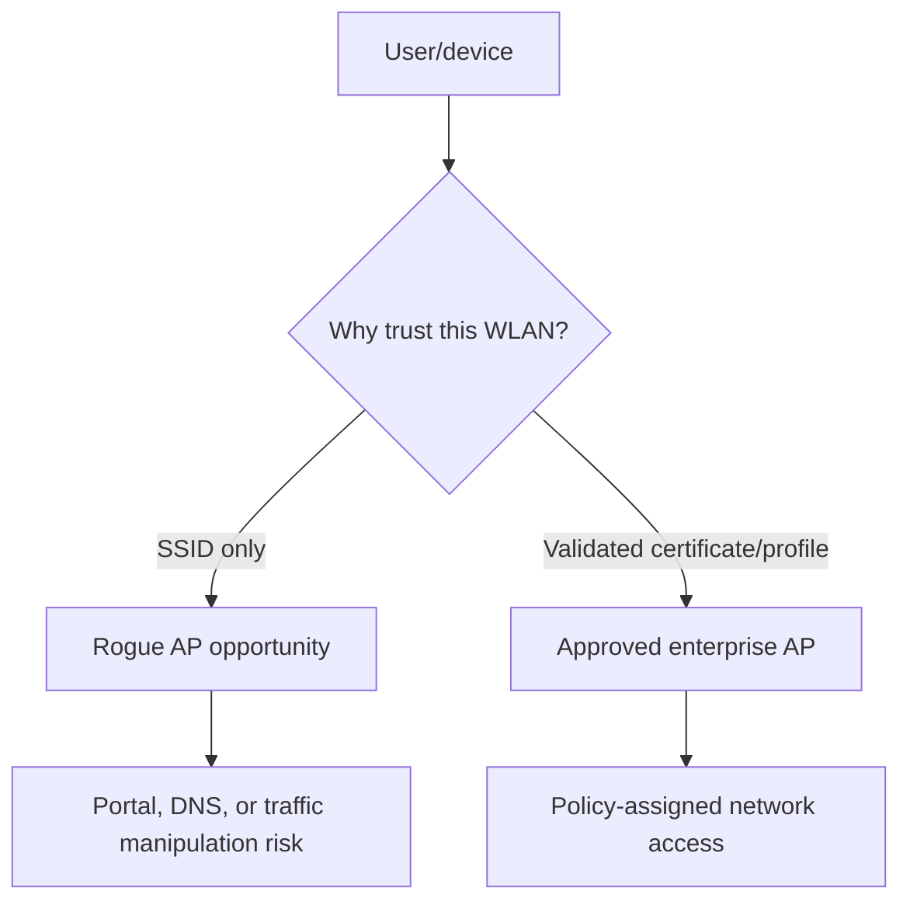
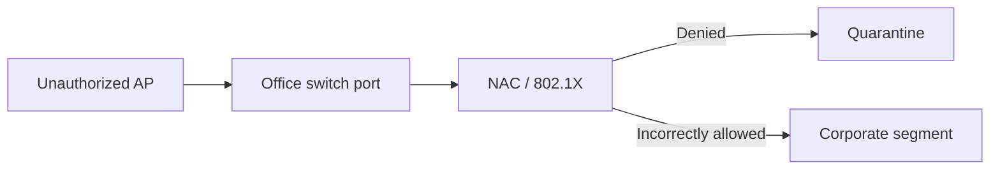

# Rogue Access Points & Wireless Trust

> [!abstract] Enterprise methodology
> Rogue-AP testing evaluates whether clients trust names instead of authenticated infrastructure, whether wired controls detect unauthorized radios, and whether identity, onboarding, and monitoring prevent a nearby attacker from becoming a network intermediary.

## Trust paths



## Rogue categories

- **Evil twin:** attacker-controlled AP imitates an approved SSID.
- **Unauthorized internal AP:** employee/device bridges the wired network to radio.
- **Misconfigured approved AP:** legitimate infrastructure advertises unsafe security.
- **Ad hoc/hotspot:** unmanaged peer or phone tethering bypasses policy.
- **Rogue client:** device associates with prohibited external networks.

## Test design

Use a dedicated test SSID/profile, synthetic identity, approved channel, low transmit power, and RF-contained location where possible. Never imitate a production SSID or collect credentials without explicit approval.

Document the expected control chain:

```text
1. Managed device receives signed WLAN profile
2. Device validates RADIUS server certificate and expected identity
3. Network-access control assigns role/VLAN
4. Wireless IDS detects unauthorized BSSID or wired rogue AP
5. SOC triages and facilities locates device
```

## Client trust assessment

Check whether managed clients:

- Autojoin by SSID alone.
- Validate certificate chain, name, and expected identity.
- Prefer stronger security over signal strength.
- Expose probe requests for hidden/preferred networks.
- Permit user-created profiles that override managed policy.
- Retain networks after offboarding.

Representative controlled observation:

```text
Test SSID: Corp-Audit
Managed profile expected server: radius.example.internal
Presented test certificate: untrusted audit CA
Expected: connection rejected
Observed: OS prompts user to accept certificate manually
Risk: user-mediated credential disclosure path
```

## Wired-side rogue AP

An unauthorized AP connected to an office port can bypass physical and network boundaries. Validate switch-port authentication, NAC, DHCP snooping, allowed-device policy, segmentation, and whether infrastructure detects a new bridge/MAC pattern.



## Detection exercise

Coordinate a time-boxed test with the SOC and wireless team. Measure:

- Detection latency.
- Correct classification and location.
- Correlation with switch and DHCP data.
- Analyst ability to distinguish sanctioned test infrastructure.
- Containment and escalation workflow.

Do not perform automated containment against unknown radios; neighboring businesses and personal devices may be lawful.

## Remediation

Deploy signed managed WLAN profiles, certificate-based EAP, strict server-name validation, PMF, 802.1X/NAC on wired ports, wireless intrusion monitoring, inventory reconciliation, and user training that explains certificate warnings rather than teaching users to click through them.

---
> 🔼 Up: [[Wireless & Physical Penetration Testing]]
