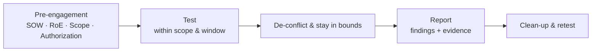
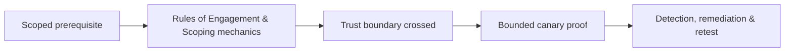

# ⚔️ Rules of Engagement & Scoping

> [!abstract] Note of [[Methodologies & Frameworks]]
> The single thing that separates a **penetration tester** from a **criminal** is *authorization*. This note is the least glamorous and most important in the offensive tree: the paperwork and boundaries that make everything else legal. Skip it and your best exploit is a felony.

## The documents that authorize an engagement
| Document | Purpose |
| --- | --- |
| **Statement of Work (SOW)** | The master contract — objectives, deliverables, timeline, cost, and the type of assessment (black/grey/white-box). |
| **Rules of Engagement (RoE)** | The operational rulebook — *what* you may do, *when*, *how*, and *what is forbidden*. |
| **Scope document** | The exact targets — IP ranges, domains, apps, accounts — that are **in** vs **out** of bounds. |
| **Authorization letter ("get-out-of-jail")** | Signed proof from someone empowered to grant it, carried during the test. |
| **NDA** | Protects the confidential data you'll inevitably see. |

## Defining scope precisely
Scope is defined by **explicit inclusion**, and everything else is out:
- **Targets:** specific `CIDR` ranges, hostnames, URLs, mobile apps, API endpoints, wireless SSIDs, or physical locations.
- **Depth:** may you exploit, or only identify? May you pivot? Escalate? Exfiltrate (and if so, *dummy* data only)?
- **Accounts:** provided test credentials vs. must-obtain-your-own.
- **Assessment type:** external vs internal, authenticated vs unauthenticated, assumed-breach.

> [!danger] Out-of-scope risks — where testers get into real trouble
> - **Third-party & cloud assets.** A target's app may run on **AWS/Azure/Cloudflare** — attacking it can violate the *provider's* terms and needs their authorization too.
> - **Scope creep via pivoting.** A foothold may reach a host that is *not* in scope. Stop at the boundary; document the *path*, don't cross it.
> - **Shared infrastructure.** Hitting one virtual host on shared hosting can take down unrelated tenants.
> - **DoS & destructive tests.** Usually **explicitly forbidden** unless contracted; even a heavy scan can crash fragile production systems.
> - **Data handling.** Real PII/PHI you access must be handled per the RoE — often "prove access, don't extract."

## Rules of Engagement essentials
A solid RoE nails down:
- **Testing window** (e.g. business hours only, or a maintenance window) and **timezone**.
- **Emergency contacts** on both sides + an **abort procedure** ("if X, stop and call").
- **De-confliction:** how the blue team distinguishes *your* traffic from a real attacker (source IPs, a header, a keyword).
- **Evidence & OPSEC:** what you log, how findings are stored/encrypted, and clean-up (remove shells, test accounts, uploaded files).
- **Explicitly forbidden:** social-engineering *these* people, physical entry, DoS, modifying/deleting data, phishing personal accounts.

## The professional workflow


> [!tip] Crook → Root
> **Crook** asks "how do I get in?" **Root** asks first: *"Is it in scope, am I inside the window, and do I have a signed authorization in my pocket?"* Every technique in this domain is **authorized simulation** — the authorization is the technique that makes the rest legal.

---
> 🔼 Up: [[Methodologies & Frameworks]]

## Core Concept

**Rules of Engagement & Scoping** is the atomic learning objective of this note. Identify its trust boundary, prerequisites, attacker-controlled input or state, vulnerable transformation, violated security invariant, minimum evidence, business consequence, and safe stopping point. The mechanism must remain explainable without depending on a specific product.

## Visual Attack Flow



## Practical Payloads & Execution

```text
engagement_action=Rules of Engagement & Scoping
asset=C2R-CANARY
identity=authorized-test-principal
impact_ceiling=single synthetic proof
```

### Expected output

```text
expected_output=C2R_CANARY_PROOF
cleanup=verified
retest_condition=recorded
```

Treat the output as proof of only the stated condition. Repeat with a negative control, preserve timestamps and the affected build, and never expand impact merely because another path appears reachable.

## Real-World Scenario

A regulated enterprise assessment applies **Rules of Engagement & Scoping** to a canary asset. Scope, evidence provenance, decision points, control outcomes, cleanup, ownership, and retest criteria are recorded so another qualified operator can reproduce the conclusion.

The durable remediation belongs at the authoritative enforcement layer. Retest the original condition and meaningful variants while verifying legitimate workflows still function.
