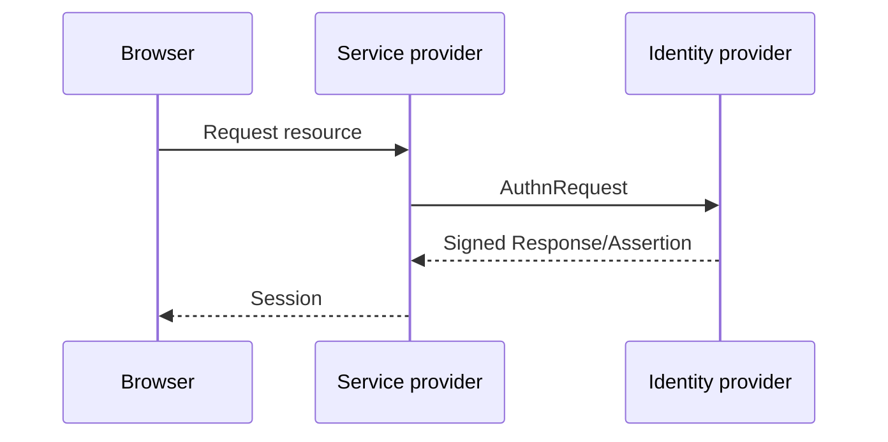
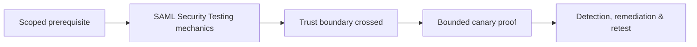

# SAML Security Testing

SAML federation relies on signed XML assertions, metadata, bindings, endpoint trust, audience, recipient, time, and identity mapping.



Test signature location and reference, response vs assertion signing policy, XML signature wrapping resistance, duplicate elements, canonicalization, certificate trust/rotation, audience, recipient, destination, InResponseTo, timestamps, replay, RelayState, logout, and attribute-to-role mapping.

Use a controlled assertion fixture; do not forge production identities. Parser differentials and comment/namespace behavior should be tested only to establish validation defects.

```text
Assertion ID: canary-42
Audience: app.example.test
Expected: rejected after first use
Observed: replay creates second session
```

Remediate with maintained SAML libraries, schema validation, one trusted ID lookup, strict signature reference, replay cache, exact metadata, clock policy, and safe claim mapping. Mastery lab: validate signed response, tampered assertion, replay, expiry, and role mapping.

---
> 🔼 Up: [[Web Identity & Access Control]]

## Core Concept

**SAML Security Testing** is the atomic learning objective of this note. Identify its trust boundary, prerequisites, attacker-controlled input or state, vulnerable transformation, violated security invariant, minimum evidence, business consequence, and safe stopping point. The mechanism must remain explainable without depending on a specific product.

## Visual Attack Flow



## Practical Payloads & Execution

```http
POST /c2r-lab/saml-security-testing HTTP/1.1
Host: app.example.test
Authorization: Bearer <CANARY_IDENTITY>
Content-Type: application/json

{"object":"C2R-CANARY","test":true}
```

### Expected output

```text
HTTP/1.1 200 OK
X-C2R-Result: vulnerable-condition-observed
{"marker":"C2R-CANARY-PROOF"}
```

Treat the output as proof of only the stated condition. Repeat with a negative control, preserve timestamps and the affected build, and never expand impact merely because another path appears reachable.

## Real-World Scenario

A multi-tenant enterprise service exposes a scoped **SAML Security Testing** condition to a synthetic customer account. The assessor proves one trust-boundary failure with a canary object, correlates application and identity telemetry, removes test state, and assigns the authoritative server-side control.

The durable remediation belongs at the authoritative enforcement layer. Retest the original condition and meaningful variants while verifying legitimate workflows still function.
