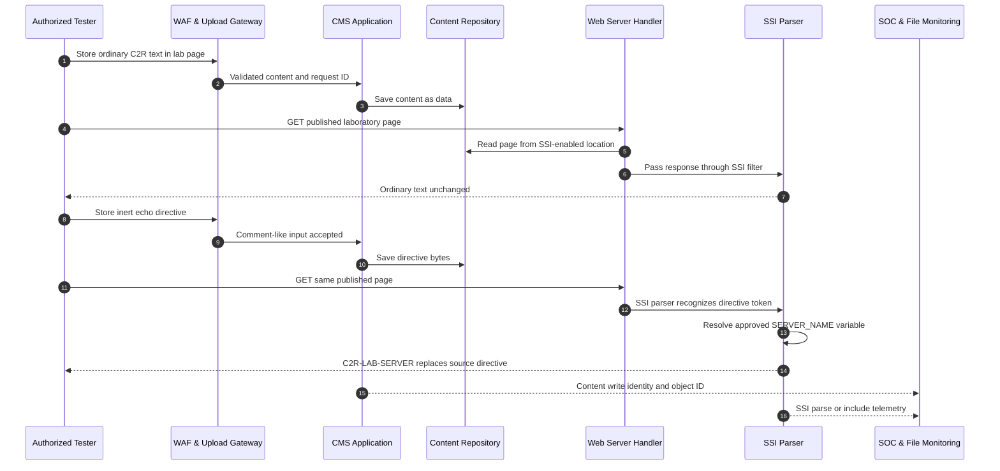

# SSI Injection

> [!warning] Authorized validation only
> Use only the inert `echo` directive in an isolated fixture. Do not invoke `exec`, include sensitive files, alter server configuration, or upload directives to production content.

## Core Vulnerability & Parser Mechanics (Zero)

Server-Side Includes (SSI) are directives embedded in text—usually HTML—that a web server or filter evaluates before sending the response. SSI injection occurs when untrusted content is stored or reflected into an SSI-enabled resource and is subsequently interpreted as directive source. The root cause is a second-pass parser crossing: data accepted by the application later enters the SSI directive grammar.

Classic syntax resembles an HTML comment: `<!--#echo var="SERVER_NAME" -->`. Depending on server and configuration, directives can echo environment variables, include virtual or file resources, inspect file metadata, configure formatting, evaluate conditions, or invoke commands. The `exec` capability is especially dangerous and should be disabled; it is not required to prove the vulnerability. Apache commonly processes SSI through `mod_include` for configured content types or extensions such as `.shtml`. Nginx has an SSI filter with a different directive set and execution model. Other gateways and content-management systems may implement compatible-looking but nonidentical grammars.

Processing eligibility is central to analysis. A directive in a `.html` file may render literally while the same bytes in `.shtml`, an `XBitHack`-eligible file, an SSI-filtered location, or a response with a specific handler are evaluated. Content can cross this boundary after upload, CMS publication, template rendering, reverse-proxy subrequests, or static-site generation. The report should identify the write path, storage representation, serving path, MIME type, handler, and exact processing pass.

SSI injection differs from SSTI. A template engine evaluates its own expression language inside application runtime, whereas SSI is usually handled by a web server or response filter. It also differs from XSS: a literal directive sent to the browser has not executed server-side. A safe canary should demonstrate server substitution—such as the known laboratory server name—without accessing files or spawning processes.

Input filtering often fails because the write and render paths use different encodings. A CMS may HTML-encode `<` and `>` during preview but decode entities before publishing. A proxy might decompress, transform, and pass content to an SSI filter. Multiple rendering passes can turn inert text into active source. Splitting directive tokens across application fields is only relevant if a later concatenation reassembles them before SSI processing. Defensive analysis traces exact bytes after every stage instead of collecting generic bypass strings.

The preferred architecture is to disable SSI where it is unnecessary. If includes are needed, only trusted deployment artifacts should contain directives; user content must be stored outside processed locations and served with a non-SSI content type from a separate origin. Disable `exec`, constrain includes, apply least filesystem privilege, and prevent uploaded files from selecting handlers through names or metadata.

## Visual Attack Flow



This is often a two-request vulnerability: one request stores data and a later request causes server-side interpretation. Detection must connect writer, content object, processing handler, and reader.

## Weaponization & Practical Execution (Mastery)

### Store and render an inert directive

Write to the dedicated fixture:

```http
POST /lab/pages/c2r-preview HTTP/1.1
Host: cms.example.test
Content-Type: application/json
X-Assessment-ID: C2R-SSI-004

{"body":"Build node: <!--#echo var=\"SERVER_NAME\" -->"}
```

```http
HTTP/1.1 201 Created
Content-Type: application/json
Location: /lab/published/c2r-preview.shtml

{"id":"c2r-preview","synthetic":true}
```

Retrieve the published resource:

```http
GET /lab/published/c2r-preview.shtml HTTP/1.1
Host: cms.example.test
Accept: text/html
X-Assessment-ID: C2R-SSI-004
```

Vulnerable response:

```http
HTTP/1.1 200 OK
Content-Type: text/html
X-Request-ID: req-ssi-604

<p>Build node: C2R-LAB-SERVER</p>
```

Secure response either renders the directive literally or serves encoded user data from a non-SSI origin:

```http
HTTP/1.1 200 OK
Content-Type: text/html

<p>Build node: &lt;!--#echo var=&quot;SERVER_NAME&quot; --&gt;</p>
```

Server trace in the fixture:

```text
uri=/lab/published/c2r-preview.shtml
handler=server-parsed
ssi_directive=echo
ssi_variable=SERVER_NAME
source_object=c2r-preview
writer_subject=assessment-c2r
request_id=req-ssi-604
```

Do not use `exec`, `include file`, or sensitive environment variables. The visible replacement of an inert directive proves that untrusted bytes reached the SSI parser.

### Processing-boundary matrix

```python
import requests

BASE = "https://cms.example.test"
HEADERS = {"X-Assessment-ID": "C2R-SSI-004"}
paths = [
    "/lab/published/c2r-preview.html",
    "/lab/published/c2r-preview.shtml",
    "/lab/static/c2r-preview.txt",
]

for path in paths:
    r = requests.get(BASE + path, headers=HEADERS, timeout=3)
    print(path, r.status_code,
          "evaluated=", "C2R-LAB-SERVER" in r.text,
          "literal=", "<!--#echo" in r.text,
          "type=", r.headers.get("Content-Type"))
```

```text
/lab/published/c2r-preview.html  200 evaluated=False literal=True  type=text/html
/lab/published/c2r-preview.shtml 200 evaluated=True  literal=False type=text/html
/lab/static/c2r-preview.txt      200 evaluated=False literal=True  type=text/plain
finding: only the server-parsed handler evaluates stored input
```

This matrix identifies the configuration boundary. Additional approved tests compare HTML entities, percent encoding in the write API, content-type changes, filename normalization, and preview-versus-publish paths. A representation that becomes active only after publishing indicates a dangerous second decode or render pass. Avoid token-fragment recipes; document the observed transformation and remove SSI processing from untrusted content.

## Red Team OpSec & Impact

An authorized CMS assessment found that editors could create preview pages which were later published under a `.shtml` route. In preview, an SSI comment rendered literally. After publication, the `echo SERVER_NAME` canary became `C2R-LAB-SERVER`, proving server-side directive evaluation. The tester used no include or execution directive and deleted the synthetic object through the agreed cleanup procedure. Configuration review showed that a broad location rule enabled SSI for the entire published directory.

The WAF treated the directive as an HTML comment and did not alert. The best evidence came from joining the content-write event to the server-parsed response. Detection should inspect stored content for SSI opener patterns after canonicalization, monitor creation or modification of SSI-enabled extensions, alert when user-controlled objects enter a server-parsed handler, and identify SSI parser errors. File-integrity monitoring can flag new `.shtml` files or handler configuration changes; web telemetry should record handler, response filter, source object, writer identity, directive class, request ID, and status.

Process telemetry provides a critical backstop: a web server spawning a shell or utility is high severity, but defenders should not wait for that consequence. Include attempts outside approved roots, SSI error strings such as `an error occurred while processing this directive`, and unexpected subrequests are useful signals. A SIEM correlation can connect a POST that stores `<!--#` after final decoding with a subsequent GET served through an SSI handler for the same object.

The remediation disabled SSI for the user-content location, moved published uploads to a separate static origin, removed executable handlers, and disabled the `exec` capability globally. Regression tests cover preview and publish paths, extension and case normalization, MIME overrides, entity decoding, archive extraction, and reverse-proxy routes. Purple-team replay confirmed directives remain inert text and no SSI parser event occurs.

---
> 🔼 Up: [[Web Injection Testing]]
