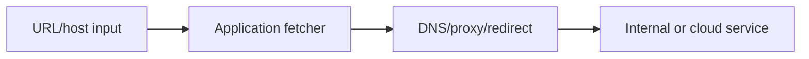
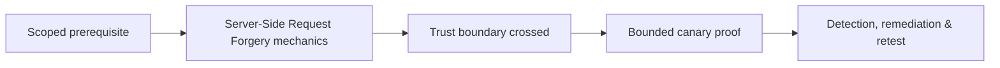

# Server-Side Request Forgery

SSRF causes a server to initiate attacker-influenced network requests from a trusted position.



Test URL parsing, schemes, redirects, DNS rebinding assumptions, IPv4/IPv6 representations, credentials, proxies, allowlists, response reflection, blind callbacks, cloud metadata boundaries, and egress policy. Use owned canary endpoints and internal fixtures; do not access real metadata or internal secrets.

```text
input: https://canary.example/ssrf-42
observation: request received from application subnet with service UA
impact: outbound fetch confirmed; internal reachability untested
```

Remediate with destination allowlists by resolved IP and scheme, repeated validation after redirects/DNS, network egress controls, metadata protections, no arbitrary response relay, and resource limits. Mastery lab: implement secure fetcher behavior across redirects, dual stack, and DNS changes.

---
> 🔼 Up: [[HTTP Architecture & Advanced Web Attacks]]

## Core Concept

**Server-Side Request Forgery** is the atomic learning objective of this note. Identify its trust boundary, prerequisites, attacker-controlled input or state, vulnerable transformation, violated security invariant, minimum evidence, business consequence, and safe stopping point. The mechanism must remain explainable without depending on a specific product.

## Visual Attack Flow



## Practical Payloads & Execution

```http
POST /c2r-lab/server-side-request-forgery HTTP/1.1
Host: app.example.test
Authorization: Bearer <CANARY_IDENTITY>
Content-Type: application/json

{"object":"C2R-CANARY","test":true}
```

### Expected output

```text
HTTP/1.1 200 OK
X-C2R-Result: vulnerable-condition-observed
{"marker":"C2R-CANARY-PROOF"}
```

Treat the output as proof of only the stated condition. Repeat with a negative control, preserve timestamps and the affected build, and never expand impact merely because another path appears reachable.

## Real-World Scenario

A multi-tenant enterprise service exposes a scoped **Server-Side Request Forgery** condition to a synthetic customer account. The assessor proves one trust-boundary failure with a canary object, correlates application and identity telemetry, removes test state, and assigns the authoritative server-side control.

The durable remediation belongs at the authoritative enforcement layer. Retest the original condition and meaningful variants while verifying legitimate workflows still function.
