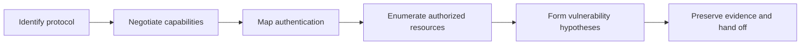
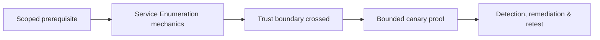

# Service Enumeration

> [!abstract] Methodology
> Enumeration turns an open transport endpoint into a protocol-aware attack-surface model. It identifies the real service, negotiates capabilities, maps authentication and authorization, inventories exposed resources, and defines the least harmful verification question. Port numbers start the conversation; protocol behavior provides the evidence.

> [!warning] Scope and minimization
> Anonymous-access tests, user discovery, management queries, and share listing can expose confidential data or trigger controls. Use approved identities and synthetic resources, collect the minimum proof, and stop before exploitation.

## The protocol-enumeration loop



For every service answer:

1. What protocol is actually speaking?
2. Which implementation, version family, dialect, extensions, and encryption are visible?
3. Which authentication methods and trust assumptions exist?
4. What can anonymous, guest, low-privilege, and privileged identities observe?
5. Which resources or operations are exposed?
6. Which condition would make the exposure vulnerable?

## Banner and capability analysis

Greetings, certificates, protocol negotiation, method lists, error codes, and timing can identify service families. But banners are mutable. A reverse proxy, compatibility layer, deception service, or administrator can change them.

Independent indicators are stronger:

- Protocol-compliant response structure.
- Supported extension or dialect set.
- Cryptographic negotiation.
- Host key or certificate identity.
- Error behavior under valid and invalid requests.
- Approved authenticated build information.

## SMB and file-sharing semantics

SMB enumeration should determine:

- Supported dialects and whether obsolete versions remain.
- Signing support and whether signing is required.
- Domain/workgroup identity and server role.
- Guest/anonymous behavior.
- Share names, descriptions, and access boundaries.
- Read/write/delete behavior using synthetic test content.
- File and directory ACL consistency across approved identities.

Security meaning comes from the combination. A writable share may be intended; risk depends on who can write, who later executes or trusts its content, whether sensitive data is exposed, and whether signing/relay protections are adequate.

## RPC and distributed service surfaces

RPC systems expose interfaces identified by program numbers, UUIDs, endpoints, and transports. Enumeration maps which interfaces are reachable and which host role they imply. The presence of an interface does not prove an exploitable method.

For network file systems, examine:

- Exported paths and allowed client ranges.
- Read/write policy.
- Identity mapping and root squashing.
- Symbolic-link and traversal behavior.
- Sensitive backups or configuration content.
- Whether transport and authentication meet the trust boundary.

Start read-only and use a controlled mount point. Availability and data-integrity risk can be high.

## SNMP and management protocols

Network-management protocols can expose system identity, interfaces, routes, neighbors, processes, installed software, environmental sensors, and configuration. Assess:

- Protocol version and encryption/authentication mode.
- Credential strength and reuse.
- Read versus write capability.
- Source-network restrictions.
- Internet or user-segment exposure.
- Sensitive object trees and vendor extensions.

Older community-string models send reusable credentials without modern confidentiality. Version 3 can provide authentication and privacy, but only when configured correctly.

## FTP and file-transfer services

The enumeration questions are:

- Is anonymous access enabled, and what can it read?
- Can anonymous or low-privilege users write, rename, overwrite, or delete?
- Is transport encryption available and enforced?
- Are credentials or sensitive backups exposed?
- Can uploaded content influence a web root, job queue, update mechanism, or another user's workflow?
- Does path canonicalization prevent traversal?

Use a uniquely named harmless test file only when writes are approved, then remove it and retain evidence of cleanup.

## SMTP and mail infrastructure

SMTP capabilities reveal transport security, message-size limits, authentication mechanisms, and server role. Enumeration should assess:

- Whether TLS is offered and enforced where expected.
- Whether authentication is exposed on the correct submission service.
- Whether user/list verification creates differential responses.
- Whether relay policy distinguishes trusted and untrusted clients.
- Whether mail routing and domain policy align.
- Whether error messages leak internal hostnames or software details.

Do not send phishing or third-party relay traffic during enumeration. Use client-provided test identities and controlled recipients.

## SSH and remote administration

Assess protocol version, host-key algorithms, key sizes, ciphers, MACs, key exchange, and authentication methods. Important questions:

- Is password authentication necessary or avoidable?
- Are obsolete algorithms accepted?
- Are host keys unexpectedly reused across unrelated systems?
- Is the service exposed beyond management networks?
- Are root/administrator logins allowed?
- Are rate limiting and centralized authentication present?

A product banner alone does not prove patch state.

## Web and TLS-wrapped services

Web enumeration maps virtual hosts, redirects, status behavior, methods, cookies, authentication schemes, API descriptions, management consoles, and error handling. TLS adds certificate identity, protocol versions, cipher policy, client-certificate requirements, and application-protocol negotiation.

Avoid state-changing routes. Crawling must respect rate limits, tenant boundaries, logout behavior, purchase/delete actions, and session scope.

## Databases, caches, and message systems

Determine:

- Whether network exposure matches architecture.
- Whether authentication is mandatory.
- Whether transport encryption is required.
- Which server role and version family are visible.
- What metadata a low-privilege identity can enumerate.
- Whether administrative interfaces are separated.
- Whether dangerous features are enabled by default.

Do not modify data or configuration to prove access. A read-only metadata query or authenticated connection failure is often sufficient.

## Authentication-state matrix

Compare behavior systematically:

| State | What to observe |
|---|---|
| Unauthenticated | Public capabilities, banners, anonymous resources |
| Invalid identity | Error consistency and user-enumeration leakage |
| Approved low privilege | Least-privilege boundaries and metadata exposure |
| Approved elevated test role | Administrative separation and audit logging |

Do not use real users when synthetic accounts can prove the condition.

## From observation to hypothesis

Enumeration should produce testable claims, not exploit attempts:

```text
Observation: SMB signing is supported but not required.
Hypothesis: Some authenticated sessions may be relayable within the scoped segment.
Required preconditions: Reachability, authentication trigger, target accepting relayed identity.
Next action: Controlled relay-resistance validation under explicit authorization.
```

## Deliverable

Create one record per service instance:

```text
Asset and endpoint
Protocol and confidence
Capabilities/dialects/extensions
Authentication and encryption
Exposed resources by test identity
Observed controls
Potential weakness and prerequisites
Evidence location
Next safe verification question
```

Root-level enumeration separates protocol fact from vulnerability claim. It explains what the service offers, who can use it, which trust boundary it crosses, and exactly what must be true before exploitation is considered.

---
> 🔼 Up: [[Network Penetration Testing]]

## Core Concept

**Service Enumeration** is the atomic learning objective of this note. Identify its trust boundary, prerequisites, attacker-controlled input or state, vulnerable transformation, violated security invariant, minimum evidence, business consequence, and safe stopping point. The mechanism must remain explainable without depending on a specific product.

## Visual Attack Flow



## Practical Payloads & Execution

```text
target=198.51.100.20 or designated enterprise canary
identity=assessment-user
action=Service Enumeration
rate_and_scope=approved
```

### Expected output

```text
observable_result=C2R_CANARY_PROOF
unauthorized_targets=0
evidence_timestamp=recorded
```

Treat the output as proof of only the stated condition. Repeat with a negative control, preserve timestamps and the affected build, and never expand impact merely because another path appears reachable.

## Real-World Scenario

A scoped enterprise infrastructure assessment applies **Service Enumeration** only to documentation-range addresses and designated canary services. Activity is rate-limited, ownership is verified, protocol evidence is captured, and broad exploitation is explicitly avoided.

The durable remediation belongs at the authoritative enforcement layer. Retest the original condition and meaningful variants while verifying legitimate workflows still function.
