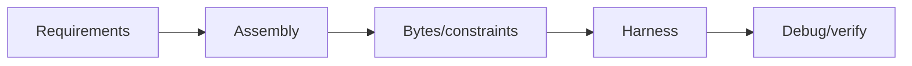
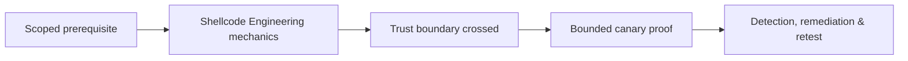

# Shellcode Engineering

Shellcode is position-independent machine code designed for constrained execution. Study it through harmless canary actions in isolated processes.



Cover ABI/syscalls, position independence, null/bad bytes, stack alignment, data discovery, relocations, encoders, staged vs single-stage design, architecture, and process protections. Do not create unauthorized callbacks.

Mastery lab: write canary shellcode that exits with a chosen code or writes a fixed marker to stdout; test x86-64 and AArch64 harnesses and document bytes/instructions.

## Constraint-driven construction

Define architecture, execution mode, calling convention, available registers, writable memory, stack alignment, prohibited bytes, maximum length, and permitted outcome. Assemble and disassemble the exact byte sequence, then single-step it in a harness that provides guard pages and captures system calls.

```text
goal: write fixed marker to inherited stdout, then exit
constraints: x86-64, position-independent, no external symbols
validation: expected bytes written; no files or network; exit code 42
```

Position independence uses instruction-relative addressing or runtime data discovery instead of fixed addresses. Encoders introduce a decoder and therefore new bad-byte and permission constraints. Staging trades payload size for transport and trust complexity. Modern mitigations may prohibit writable-executable memory, constrain indirect branches, or enforce signatures. Keep educational shellcode inert; document each instruction’s inputs, outputs, stack effect, and syscall side effects. Mastery includes explaining why the same bytes fail under a different ABI, architecture, sandbox, or memory-protection policy.

---
> 🔼 Up: [[Exploit Construction & Control Flow]]

## Core Concept

**Shellcode Engineering** is the atomic learning objective of this note. Identify its trust boundary, prerequisites, attacker-controlled input or state, vulnerable transformation, violated security invariant, minimum evidence, business consequence, and safe stopping point. The mechanism must remain explainable without depending on a specific product.

## Visual Attack Flow



## Practical Payloads & Execution

```text
fixture=Shellcode Engineering
build=instrumented-debug
action=trigger minimized canary input
impact_ceiling=fixed marker or deterministic crash
```

### Expected output

```text
result=C2R_CANARY_PROOF
mitigation_state=recorded
production_boundary_crossed=false
```

Treat the output as proof of only the stated condition. Repeat with a negative control, preserve timestamps and the affected build, and never expand impact merely because another path appears reachable.

## Real-World Scenario

A vendor-owned instrumented build reproduces **Shellcode Engineering**. The researcher demonstrates only a fixed marker or deterministic crash, records architecture and mitigation assumptions, patches the root defect, and retains the minimized input as a regression test.

The durable remediation belongs at the authoritative enforcement layer. Retest the original condition and meaningful variants while verifying legitimate workflows still function.
