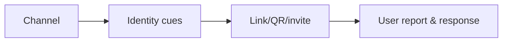
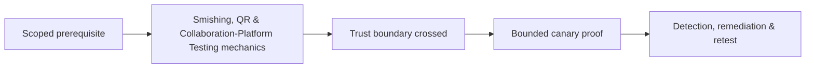

# Smishing, QR & Collaboration-Platform Testing

SMS, QR, chat, file-sharing, and collaboration invitations move trust outside traditional email controls.



Use company-owned numbers/accounts and benign canaries. Test sender verification, link preview, external labels, QR scanning policy, app-consent workflow, reporting, and SOC visibility. Mastery lab: compare the same safe scenario across email, SMS, and chat and identify control gaps.

## Channel analysis

Each channel removes different defensive context. SMS compresses sender identity and URL visibility. QR codes move destination inspection to a second device. Collaboration platforms inherit trust from existing teams and may permit external tenants, application consent, file previews, or notification-based urgency.

Build a matrix for sender provenance, destination visibility, authentication, content scanning, external-party labeling, reporting path, retention, and SOC telemetry. Use the same harmless business scenario across channels to expose control asymmetry.

```text
Channel      Sender cue        Destination cue      Report path
SMS          phone number      shortened preview    forward to security number
QR poster    physical context  hidden until scan    service desk / QR report
Team chat    display name      rich preview          built-in report action
```

The canary destination should collect only an opaque exercise identifier, never credentials or device fingerprinting beyond the approved metric. Test revocation of malicious invitations and app grants, not just message deletion. Remediation may include managed QR scanning, external-tenant restrictions, safe-link inspection, clear external labels, one-tap reporting, and correlation across mail, mobile, identity, and collaboration logs.

---
> 🔼 Up: [[Phishing & Messaging Security Testing]]

## Core Concept

**Smishing, QR & Collaboration-Platform Testing** is the atomic learning objective of this note. Identify its trust boundary, prerequisites, attacker-controlled input or state, vulnerable transformation, violated security invariant, minimum evidence, business consequence, and safe stopping point. The mechanism must remain explainable without depending on a specific product.

## Visual Attack Flow



## Practical Payloads & Execution

```text
exercise=Smishing, QR & Collaboration-Platform Testing
cohort=privacy-approved canary group
maximum_action=harmless marker
real_credentials_collected=false
```

### Expected output

```text
prevented_or_reported=true
participant_harm=none
control_owner=identified
```

Treat the output as proof of only the stated condition. Repeat with a negative control, preserve timestamps and the affected build, and never expand impact merely because another path appears reachable.

## Real-World Scenario

A privacy-approved enterprise exercise applies **Smishing, QR & Collaboration-Platform Testing** with synthetic identities and a harmless canary action. Legal, HR, privacy, and the white team define prohibited themes and stop conditions; results measure process and control performance rather than individuals.

The durable remediation belongs at the authoritative enforcement layer. Retest the original condition and meaningful variants while verifying legitimate workflows still function.
