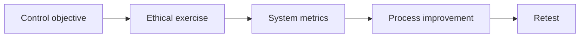

# Social Engineering Exercise Governance & Metrics

## 🗺️ Zero-to-Mastery Learning Path

1. [[Social Engineering Safety & Ethics]]
2. [[Human-Risk Metrics & Program Improvement]]

---
> 🔼 Up: [[Social Engineering]]
